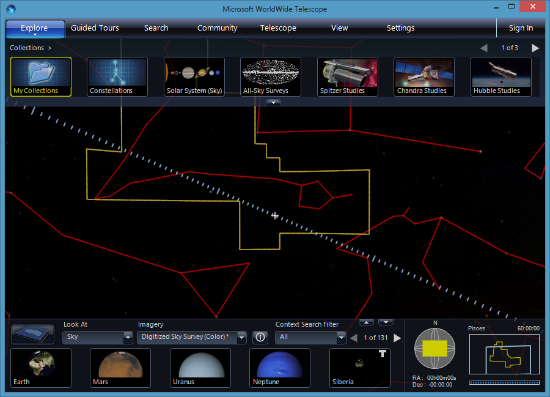

Converted from hmtl to md https://domchristie.github.io/to-markdown/

# <a name="WorldWideTelescopeUserGuide">WorldWide Telescope User Guide</a>

Note: This documentation is preliminary and subject to change.

The WorldWide Telescope is a software environment that enables your computer to function as a virtual telescope, combining terabytes of imagery from such famous telescopes as Hubble, Chandra and Spitzer into one vast panorama of the universe.

WorldWide Telescope allows seamless panning and zooming around the night sky, our Solar System, and other space-orientated panoramas, such as the pictures taken of the surfaces of the Moon and Mars. [Explore](#Exploring) the sky at multiple wavelengths: see the x-ray view of the sky and zoom into bright radiation clouds, and then cross-fade into the visible light view and discover the cloud remnants of a supernova explosion from a thousand years ago. Switch to the Hydrogen Alpha view to see the distribution and illumination of massive primordial hydrogen cloud structures lit up by the high energy radiation coming from nearby stars in the Milky Way.

For a dazzling educational experience, our Solar System is modeled in three dimensions, with the planets rotating and orbiting the Sun. Watch the majestic beauty of Saturn's rings or the distant orbit of the dwarf planet Pluto as they track across the sky in their accurately modeled days and years. Accelerate the simulated time to plan a visit to the best spot for the next solar or lunar eclipse.

Newcomers to WorldWide Telescope are recommended to browse the growing number of [Guided Tours](#GuidedTours) of the sky by astronomers and educators from some of the most respected observatories and planetariums. Most of the features can be discovered simply by using the program. This documentation is provided as a resource to help describe what is going on, and to help locate the features that this project has to offer. There are two versions of WorldWide Telescope, a Windows application and a web client. This documentation set describes both, where necessary indicating where a feature only applies to one. The essential differences between the two are that the Windows version is downloaded and installed first, then run, and has a few more features. The web client is not downloaded and installed, is based on HTML5, and has fewer features but can be customized.

_WorldWide Telescope is created by Microsoft Research using the Microsoft high performance Visual Experience Engine , and the project is dedicated  to legendary researcher Jim Gray, without whom this project would not have happened. WorldWide Telescope is released as a free resource to the astronomy and education community with the hope that it will inspire and empower people to explore and understand the universe like never before._

## Table of Contents

*   [Screen Layout](#ScreenLayout)

    *   [The Top Panel](#TheTopPanel)
    *   [The View](#TheView)
    *   [The Lower Panel](#TheLowerPanel)
    *   [The Layer Manager](#TheLayerManager)

*   [Exploring](#Exploring)

    *   [Earth](#ExploreEarth)
        *   [Earth Tutorials](#EarthTutorials)

    *   [Tutorial: Comparing Night and Day](#TutorialComparingNightandDay)

    *   [Planet](#ExplorePlanet)
    *   [Planet Tutorials](#PlanetTutorials)

        *   [Tutorial: Locating Olympus Mons](#TutorialLocatingOlympusMons)
        *   [Tutorial: Comparing Surface Features of the Solar System](#TutorialComparingSurfaceFeaturesoftheSolarSystem)

    *   [Sky](#ExploreSky)
    *   [Sky Tutorials](#SkyTutorials)

        *   [Tutorial: Tracking a Conjunction](#TutorialTrackingaConjunction)
        *   [Tutorial: Visiting the Neighbors](#TutorialVisitingtheNeighbors)
        *   [Tutorial: The Sky Tonight](#TutorialTheSkyTonight)
        *   [Tutorial: Astronomy Terminology](#TutorialAstronomyTutorial)

    *   [Panorama](#ExplorePanorama)
    *   [Panorama Tutorials](#PanoramaTutorials)

        *   [Tutorial: Comparing Styles of Panorama](#TutorialComparingStylesofPanorama)

    *   [Solar System](#ExploreSolarSystem)
    *   [Solar System Tutorials](#SolarSystemTutorials)

        *   [Tutorial: Tracking a Solar Eclipse](#TutorialTrackingaSolarEclipse)

    *   [Sandbox](#ExploreSandbox)
    *   [Keyboard Shortcuts](#KeyboardShortcuts)
    *   [Xbox Controller](#XboxController)
    *   [Explore Menu Entries](#ExploreMenuEntries)

*   [Guided Tours](#GuidedTours)

    *   [Playing a Tour](#PlayingaTour)
    *   [Creating a Tour](#CreatingaTour)
    *   [Creating an Interactive Tour](#CreatinganInteractiveTour)
    *   [Guided Tours Menu Entries](#GuidedToursMenuEntries)

*   [Communities](#Communities)

    *   [Joining a Community](#JoiningaCommunity)
    *   [Creating a Community](#CreatingaCommunity)

*   [The Search Menu](#TheSearchMenu)

    *   [The Search Panel](#TheSearchPanel)
    *   [Search Menu Entries](#SearchMenuEntries)

*   [The View Menu](#TheViewMenu)

    *   [Observing Location](#ObservingLocation)
    *   [Observing Time](#ObservingTime)
    *   [View Menu Entries](#ViewMenuEntries)

*   [The Settings Menu](#TheSettingsMenu)

    *   [Constellation Lines](#ConstellationLines)
    *   [Experience](#Experience)
    *   [Network and Cache](#NetworkandCache)
    *   [Settings Menu Entries](#SettingsMenuEntries)

*   [The Telescope Menu](#TheTelescopeMenu)

    *   [Connecting and Controlling a Telescope](#ConnectingandControllingaTelescope)
    *   [The Telescope Panel](#TheTelescopePanel)
    *   [Telescope Menu Entries](#TelescopeMenuEntries)

*   [Astronomy Research](#AstronomyResearch)

    *   [Creating a New Collection](#CreatingaNewCollection)
    *   [Comparing Foreground and Background Images](#ComparingForegroundandBackgroundImages)
    *   [The Finder Scope](#TheFinderScope)
    *   [Virtual Observatory Tables](#VirtualObservatoryTables)
    *   [FITS Images](#FITSImages)
    *   [Sky Surveys](#SkySurveys)
    *   [Context Search](#ContextSearch)
    *   [Stellar Brightness](#StellarBrightness)

*   [Earth and Planet Research](#EarthAndPlanetResearch)

    *   [Time Series Data](#TimeSeriesData)
    *   [Time Series Tutorial](#TimeSeriesTutorial)

*   [Configuration](#Configuration)

    *   [Regional Data Cache](#RegionalDataCache)
    *   [Multi-Monitor Cluster](#MultiMonitorCluster)

        *   [Single Slave Computer](#SingleSlaveComputer)
        *   [Remote Starting of the Multi-Monitor Cluster](#RemoteStartingoftheMultiMonitorCluster)

    *   [Single-Projector Planetarium](#SingleProjectorPlanetarium)

        *   [Custom Warp Files](#CustomWarpFiles)

    *   [Multi-Projector Planetarium](#MultiProjectorPlanetarium)

        *   [Projection Designer Configuration](#ProjectionDesignerConfiguration)
        *   [External Blending Configuration](#ExternalBlendingConfiguration)

## <a name="Support">Support</a>

WorldWide Telescope is under development at Microsoft Research. Feel free to contact the development team, or post comments on public forums.

To privately send a specific bug, issue, question or comment direct to the WorldWide Telescope team at Microsoft, go to [WorldWide Telescope Support](/Support/IssuesAndBugs).

To publicly post a comment regarding the WorldWide Telescope, consider adding a comment to an appropriate entry in the [WorldWide Telescope support forum](http://forums.worldwidetelescope.org/).

#### See Also

For advanced users wishing to customize the WorldWide Telescope Web Control, refer to the [WorldWide Telescope Web Control Script Reference](http://www.worldwidetelescope.org/docs/WorldWideTelescopeWebControlScriptReference.html), or to work with the data formats and files refer to the [WorldWide Telescope Data Files Reference](http://www.worldwidetelescope.org/docs/WorldWideTelescopeDataFilesReference.html).

To see plans and instructions for building a planetarium suitable for a small class of students, refer to [WorldWide Telescope Planetarium](http://www.worldwidetelescope.org/docs/WorldWideTelescopePlanetarium.html).

|  |

* * *

## <a name="ScreenLayout">Screen Layout</a>

The following image shows the first view that will appear on running WorldWide Telescope. This section describes the layout, and how it changes depending on the selections of the user.

*   [The Top Panel](#TheTopPanel)
*   [The View](#TheView)
*   [The Lower Panel](#TheLowerPanel)

|  |

*   [WorldWide Telescope User Guide](#WorldWideTelescopeUserGuide)

* * *

### <a name="TheTopPanel">The Top Panel</a>

Along the top of the screen is the main menu, with entries **Explore**, **Guided Tours**, **Search**, **Community**, **Telescope**, **View** and **Settings**. These entries are described in detail later on in the documentation, however the basic purpose of each entry follows. Note that the main menu items can be clicked on themselves, which has a different function than selecting the down arrow and opening up the menu contents.

|  | Hovering the mouse underneath the main menu item will display a down arrow. Clicking on this down arrow will open up the menu contents. Clicking on the main menu item itself (for example, clicking on the entry **Explore**) will change the appearance of the top panel, and not display the menu contents. |

*   [**Explore**](#Exploring): The first two menu items, **New** and **Open**, are used to start new data files, or open existing data files, respectively. These are the primary purposes of the **Explore** menu - the location of data to display. Clicking the **Explore** entry itself will display the data **Collections** thumbnails across the top panel. Selecting any of these thumbnails will either open up a new set of thumbnails to browse, or change the view to display something new. These thumbnail images either reference individual items, or another set of items (similar to a folder and file structure). A set of images are referred to as _collections_ in WorldWide Telescope.
*   [**Guided Tours**](#GuidedTours): A tour in WorldWide Telescope is an animated, annotated slide-show, for educational, research or entertainment purposes, usually focusing on a particular topic. Clicking the **Guided Tours** entry itself will display the **Tours** supplied by default with the product in the top panel. The menu entries can be used to search for other tours on the web, and to create a new tour. Opening a tour can also be done from the **Explore > Open** sub-menu.
*   [**Search**](#TheSearchMenu): Clicking on this main menu item itself will change the top panel to show a range of search parameters, that are used to search on the default data provided with the product. Opening up the **Search** menu will enable some internet based searches.
*   [**Community**](#Communities): A community in WorldWide Telescope is a public or private group that can be set up to share data. Clicking on the **Community** entry itself will display the **My Communities** entries in the top panel. This list will obviously be empty the first time the product is used. Select **Join a Community** to be linked to a website with links to public communities. Joining these communities will add them to your **My Communities** list, and give you a new collection of data, magazine articles, and so on, to browse and explore.
*   [**Telescope**](#TheTelescopeMenu): This menu item should only be selected if you have a physical telescope that can be connected to your computer with a USB cable and has the appropriate software interface. If you have access to such a telescope this feature enables some interesting possibilities, including using WorldWide Telescope to identify or locate objects in the sky, and perhaps to add your own images into the mix.
*   [**View**](#TheViewMenu): This menu item displays options to control the observing location and time. You can set WorldWide Telescope to show you the view from any location around the globe, using the current time or a time/date in the past or future.
*   [**Settings**](#TheSettingsMenu): Clicking on this menu item itself will display a range of settings, these are somewhat similar to the View settings, controlling what is displayed.

The _Top Panel_ is shown in the image below. It is a glass panel that displays a range of thumbnail images. Thumbnail images are there to be clicked on, with the underlying text helping identity the data.

|  | In this top panel view, the user has selected the thumbnail **Constellations**, so the top panel now displays all 89 constellation entries. Astronomers will note that there are 88 constellations, however WorldWide Telescope treats the divided Serpens constellation as two. |
|  | If there are more thumbnails than the top panel can display, the number of rows of thumbnails (with _previous_ and _next_ arrows) will appear to the far right of the panel. Select the arrows or use the mouse wheel to scroll through the options. |

#### See Also

*   [Screen Layout](#ScreenLayout)

* * *

### <a name="TheView">The View</a>

Underneath the top panel is the main view! In this case the user has selected **Constellations** then **Cassiopeia**:

|  |

The images of the sky are annotated with the outlines of the constellations. The constellation most central to the view is referred to as the _selected_ _constellation_, and is outlined in yellow. The red lines display _figures_ - in this case linking the main stars that make up the constellation. Cassiopeia is of course known for the five bright stars making up the large _W_.

The [View Menu](#TheViewMenu) and the [Settings Menu](#TheViewMenu) have options to change what lines are drawn, and their colors. The lines shown in the image above are the default for a sky view.

To navigate the main view the primary device is the mouse. Use the mouse wheel to zoom deep into outer space, and back. Hold down the left mouse button and drag to change the angle of the view.

Clicking the right mouse button brings up the [Finder Scope](#TheFinderScope), which can be dragged around the screen with the mouse to help identify objects. In the image below, it has been used to select one of the stars in Cassiopeia.

|  |

Click the **X** in the top right corner of the **Finder Scope** to close it.

#### See Also

*   [Screen Layout](#ScreenLayout)

* * *

### <a name="TheLowerPanel">The Lower Panel</a>

At the bottom of the screen there is the lower panel. This performs a variety of functions, the most significant of which are the **Look At** and **Imagery** entries.

|  |

The **Look At** list includes **[Earth](#ExploreEarth), [Planet](#ExplorePlanet), [Sky](#ExploreSky), [Panorama](#ExplorePanorama),** and **[Solar System](#ExploreSolarSystem)**. This is the highest level list determining what to display. Selecting **Solar** **System** reveals the impressive 3D modeling of the Sun and Solar System planets (this is not currently available in the web control version of WorldWide Telescope). The **Imagery** list gives the range of data options given the selection made in the **Look At** list. For **Solar System** there is only one option. For **Sky** there is a large range of options, as there are many different wavelengths of light that can be recorded, in addition to the visible wavelength that we all see. Different wavelengths include x-ray, gamma, microwave, and so on. The most fascinating imagery is to most people the visible wavelength, but studies of the other wavelengths can reveal more specific information about what is happening, or has happened, to the stellar object.

**Panorama** is an interesting and slightly different selection. The range of imagery for this includes the pictures taken from different landing vehicles on the Moon and Mars. Selecting **Earth** gives the chance to examine our own planet closely, right down to streets and small geographic features.

The selections made in the **Look At** and **Imagery** lists greatly affects the relevance of other options (the [View](#TheViewMenu) and [Settings](#TheViewMenu) entries, for example), which are explained in detail later on in this guide.

Underneath these two list entries in the lower panel is the context list of thumbnails. A [Context Search](#ContextSearch) is carried out whenever the view is changed, and provides a thumbnail list of all the objects of interest in the current view. The more you zoom in, the shorter and shorter this list will become. For example, select **Explore** then **Constellations** then click on **Corvus**. The context list is shown in the image below:

|  |

There are a lot of entries in the list, starting with the planet Saturn. This list does not only include the stellar objects in the constellation Corvus, but all those objects in the current view. They are sorted in order. The first items are the planets and named objects, the later ones often do not have a name other than their catalog entries - _NGC4024_ for example. If this list is long, which it often is, use the previous and next arrows to scroll through it. Notice too that the context list is populated when a view comes to a halt, it is often empty when the view is animating from one location to the next. The size of the contexts lists can be reduced by de-selecting items in the **[Context Search](#ContextSearch) Filter**.

|  | Only stars and supernova will now appear in the context list - no black holes or neutron stars! |

The final elements of the lower panel are shown in the image below:

|  | The small up and down arrows can be used to show and hide the lower panel itself.

The pane to the far right of the lower panel shows the _skyball_ (displaying the field of view relative to the celestial sphere), and the selected constellation. This pane also shows the parameters of the view - the right ascension, declination and field of view in degrees (60:00:00 in this example).

You can drag the yellow rectangle around in the skyball to change the view. Click on the selected constellation to center the field of view on that constellation. |

Right ascension and declination are a well known space co-ordinate system for astronomers, but to newcomers to astronomy probably the best way to view them is as space longitude and latitude respectively. The field of view angle is at a maximum of 60 degrees, which gives a wide angle view of the sky. Zooming in can narrow this to a tiny percentage of one degree.

#### See Also

*   [Screen Layout](#ScreenLayout)
*   [WorldWide Telescope User Guide](#WorldWideTelescopeUserGuide)

* * *

### <a name="TheLayerManager">The Layer Manager</a>

You can use the **Layer Manager** to specify which layers and overlays to display, as well as a number of other view-specific settings.

**To Display the Layer Manager**

*   Click **View > Show Layer Manager**, or
*   Click the Layer Manager icon.
    

**To Add a Layer**

*   Click **Explore > Open > Layers**, or
*   Right-click a Layer Manager node, then click **Add**.

#### Layer Manager Nodes

Each view has its own node within the Layer Manager.

*   The **Sun** node lets you choose which planetary bodies and 3D models will be visible in the [3D Solar System](#ExploreSolarSystem) view. You can toggle the visibility of the planets themselves, the moons of a planet, and any 3D models associated with the planet (such as the ISS model under **Earth**). Earth also includes several overlays for clouds, elevation of geographic features, and 3D cities.
*   The **Sky** node applies to both **Sky** and **3D Solar System** views. Here you can toggle overlays for constellation figures and boundaries, coordinate system grids, and planetary orbits. You can also select background imagery (such as the Milky Way) for the 3D Solar System view.
*   The **Sandbox** node lets you add custom content to view in [Sandbox](#ExploreSandbox) mode.
*   The **Dome** node exposes options for using WorldWide Telescope with a planetarium dome.

This completes the overview of the screen layout. The following sections go into much more detail on each individual topic.

#### See Also

*   [Screen Layout](#ScreenLayout)
*   [WorldWide Telescope User Guide](#WorldWideTelescopeUserGuide)

* * *

## <a name="Exploring">Exploring</a>

Exploring the universe is the funnest thing you can do with WorldWide Telescope! This section covers the views that you can choose from, and shows you how to navigate within each view.

To select a view, use the **Look At** drop down list (at bottom left):

*   [Earth](#ExploreEarth)
*   [Earth Tutorials](#EarthTutorials)

*   [Tutorial: Comparing Night and Day](#TutorialComparingNightandDay)

*   [Planet](#ExplorePlanet)
*   [Planet Tutorials](#PlanetTutorials)

*   [Tutorial: Locating Olympus Mons](#TutorialLocatingOlympusMons)
*   [Tutorial: Comparing Surface Features of the Solar System](#TutorialComparingSurfaceFeaturesoftheSolarSystem)

*   [Sky](#ExploreSky)
*   [Sky Tutorials](#SkyTutorials)

*   [Tutorial: Tracking a Conjunction](#TutorialTrackingaConjunction)
*   [Tutorial: Visiting the Neighbors](#TutorialVisitingtheNeighbors)
*   [Tutorial: The Sky Tonight](#TutorialTheSkyTonight)
*   [Tutorial: Astronomy Terminology](#TutorialAstronomyTutorial)

*   [Panorama](#ExplorePanorama)
*   [Panorama Tutorials](#PanoramaTutorials)

*   [Tutorial: Comparing Styles of Panorama](#TutorialComparingStylesofPanorama)

*   [Solar System](#ExploreSolarSystem)
*   [Solar System Tutorials](#SolarSystemTutorials)

*   [Tutorial: Tracking a Solar Eclipse](#TutorialTrackingaSolarEclipse)

*   [Keyboard Shortcuts](#KeyboardShortcuts)
*   [Xbox Controller](#XboxController)
*   [Explore Menu Entries](#ExploreMenuEntries)

#### See Also

*   [WorldWide Telescope User Guide](#WorldWideTelescopeUserGuide)

* * *

### <a name="ExploreEarth">Earth</a>

Use **Earth** view to explore our own planet from a viewpoint in space. To enter **Earth** view, select **Earth** from the **Look At** menu (bottom left).

**To Control the View**

*   Click and drag to rotate the Earth.
*   Use the mouse wheel to zoom in and out.
*   To tilt the field of view **CTRL + click** and drag vertically.
*   To rotate the field of view **CTRL + click** and drag horizontally.

Use tilt along with the **Show Elevation Model** setting in the **Earth > Overlays** node in the Layer Manager to get a fly-over effect, and see mountain ranges and river valleys in three dimensions.

Use **View > Reset Camera** to restore the default view and settings.

Use the **Imagery** menu to choose from the available imagery options, including aerial, streets, hybrid and nighttime views.

| This image of Hawaii is obtained from the **Virtual Earth Hybrid** imagery: |
|  |

#### See Also

*   [Exploring](#Exploring)
*   [Tutorial: Comparing Night and Day](#TutorialComparingNightandDay)

* * *

### <a name="EarthTutorials">Earth Tutorials</a>

*   [Tutorial: Comparing Night and Day](#TutorialComparingNightandDay)

#### See Also

*   [Earth](#ExploreEarth)
*   [Exploring](#Exploring)
*   [Panorama Tutorials](#PanoramaTutorials)
*   [Planet Tutorials](#PlanetTutorials)
*   [Sky Tutorials](#SkyTutorials)
*   [Solar System Tutorials](#SolarSystemTutorials)

* * *

#### <a name="TutorialComparingNightandDay">Tutorial: Comparing Night and Day</a>

There are several imagery options for the Earth, including aerial photography, streets, a hybrid of these two, and a night view. The night imagery is the simplest, yet it reveals information that the other views do not convey as well. In this tutorial we'll examine relative population density by comparing night and day images.

1.  In the **Look At** list select **Earth**.
2.  In the **Imagery** list scroll to the **Bing Maps Streets** view.
3.  In the **Settings** pane ensure that **Earth Cloud Layer Overlay** is not selected.
4.  Rotate the Earth using the mouse until southwest Australia is in view, then zoom in to the following location: 

5.  Without changing the zoom or pan settings, change the **Imagery** to **Earth at Night**. Notice that the same view angle is maintained even though the imagery has changed. Try toggling the **Imagery** to **Bing Maps Streets**, then back to **Earth at Night** again. Human population density is readily revealed with the glow of artificial light in the night view. The bright areas on the night map exactly matches the city of Perth named on the **Bing Maps Streets** view. 

    Try this comparison in different locations around the world!

#### See Also

*   [Earth Tutorials](#EarthTutorials)

* * *

### <a name="ExplorePlanet">Planet</a>

Use **Planet** view to explore the other planets and some of the moons of the Solar System. To enter **Planet** view, select **Planet** from the **Look At** menu (bottom left).

**To Control the View**

*   Use the mouse wheel to zoom in and out.
*   Click and drag to rotate the planet or moon you are viewing.
*   To tilt the field of view **CTRL + click** and drag vertically.
*   To rotate the field of view **CTRL + click** and drag horizontally.

Use tilt along with the **Show Elevation Model** setting in the **Earth > Overlays** node in the Layer Manager to get a fly-over effect, and see mountain ranges and river valleys in three dimensions.

Use **View**, **Reset Camera** to restore the default view and settings.

| Some moons are available under the **Planet** imagery, including Io, one of the best known of Jupiter's many moons: |
|  |

*   [Exploring](#Exploring)
*   [Tutorial: Locating Olympus Mons](#TutorialLocatingOlympusMons)
*   [Tutorial: Comparing Surface Features of the Solar System](#TutorialComparingSurfaceFeaturesoftheSolarSystem)

* * *

### <a name="PlanetTutorials">Planet Tutorials</a>

*   [Tutorial: Locating Olympus Mons](#TutorialLocatingOlympusMons)
*   [Tutorial: Comparing Surface Features of the Solar System](#TutorialComparingSurfaceFeaturesoftheSolarSystem)

#### See Also

*   [Exploring](#Exploring)
*   [Earth Tutorials](#EarthTutorials)
*   [Planet](#ExplorePlanet)
*   [Sky Tutorials](#SkyTutorials)
*   [Panorama Tutorials](#PanoramaTutorials)
*   [Solar System Tutorials](#SolarSystemTutorials)

* * *

#### <a name="TutorialLocatingOlympusMons">Tutorial: Locating Olympus Mons</a>

Olympus Mons is the tallest mountain on Mars (and indeed the Solar System). At a colossal 17 miles high it is three times higher than Everest. The following tutorial locates the mountain:

1.  In the **Look At** list ensure that **Planet** has been selected.
2.  In the **Imagery** list click on **Mars**.
3.  Pan and rotate the view in order to locate the mountain, noting that it is close to the Martian equator. The mountain can be located visually either from its top-down view, which is distinctive, or from its proximity to three smaller mountains than are in a near perfect line. These two views are shown in the following images:

    |  |
    |  |

4.  Zoom in and use the **CTRL** key as you click and drag vertically. This will tilt the view to show just how tall Olympus Mons actually is:

    |  |

5.  Olympus Mons is a _shield_ volcano, approximately 340 miles wide. The most recent volcanic activity is estimated at 2 million years ago, so it is difficult to classify the volcano as extinct. One theory for the huge size of the mountain is that Mars does not have tectonic plates, so there is no gradual crust movement to recycle the surface.  However this theory is countered by the three mountains in a line, which suggests a plate edge. The three smaller mountains are also volcanoes and are named  Arsia Mons, Pavonis Mons  and Ascraeus Mons, though they are smaller only in relation to Olympus Mons (Arsia Mons - the southernmost - is the tallest at about 12 miles high, Pavonis Mons - the middle of the three - the shortest at 8.6 miles, and Ascraeus Mons - the northernmost - is about 11 miles high).
6.  Other surface features of Mars to look for include the great canyon, Valles Marineris, which runs along the equator and is over 2500 miles long. It is the deepest known crevice in the Solar System. Mars is also known for its plains, polar caps, and clear signs of water and wind erosion. Mars' surface temperature is quite cold, ranging from -140 to 20 Celsius. Its atmosphere is mostly carbon dioxide, but there is enough water vapor to form the occasional clouds.

#### See Also

*   [Planet Tutorials](#PlanetTutorials)
*   [Tutorial: Comparing Surface Features of the Solar System](#TutorialComparingSurfaceFeaturesoftheSolarSystem)

* * *

#### <a name="TutorialComparingSurfaceFeaturesoftheSolarSystem">Tutorial: Comparing Surface Features of the Solar System</a>

Highly detailed surface images and elevation data are currently only available for the Earth, our Moon, and Mars. However, there is enough detail on many of the solar system planets and moons to locate their most notable features.

**To View a Planet**

1.  Select **Planet** from the **Look At** menu.
2.  Click **Imagery** and select the planet you want to see.

Much more imagery data is available under **Explore > Collections > Planets/Moons**.

1.  Mercury

| Mercury is known for its craters and ridges, volcanoes and lava flows. The largest features are the very wide craters. One of these, the Caloris Basin (30.5 Lat 170.2 Lng) is particularly interesting because of the so called _Chaotic_ _terrain_ that exists diametrically opposite to it (-30.5 Lat -9.8 Lng). There is a very thin atmosphere consisting largely of sodium. Surface temperatures range from −183 (at night and in the deepest craters) to 427 Celsius (when the Sun is directly overhead). | No moons |

3.  Venus

| Venus comes closer to the Earth than any other planet in size, and closest to the Earth in distance. Its surface includes mountains, volcanoes, rift valleys, and two continents of higher elevation than the rest. It's surface is however extremely hot -- around 435 Celsius -- and is partly obscured by clouds of sulfuric acid. There is no evidence of water erosion on the planet, though there is small amounts of water vapor in the atmosphere.
Notice that Venus has fewer craters than Mercury, Mars or our Moon, which suggests the planet surface is relatively young (about 1 billion years old), though the dense atmosphere may also protect the surface to a degree. | No moons |

5.  Earth

| Refer to [Earth](#ExploreEarth). | Our solitary moon is old and heavily cratered, one of the best known craters is called Copernicus. It can be located visually using the **Explore > Collections > Planets/Moons** data (noting the three craters in a near line), or from its latitude and longitude:
 |

7.  Mars

| See the description in the [Locating Olympus Mons](#TutorialLocatingOlympusMons) tutorial. | Mars has two moons, Phobos and Deimos. Some image data is available, find the thumbnails in the **Explore > Collections > Planets/Moons** data. Currently they are not represented in the **Sky** or **SolarSystem** views. Deimos is notable for its smooth surface:

 |

9.  Jupiter

| Jupiter's surface is gaseous so there are no mountains or valleys to speak of. The most prominent surface features are the banding and the spots -- with the Great Red Spot being the largest of the spots with a diameter that exceeds that of the Earth. The spots are swirling clouds of gas, often referred to as storms but are surprisingly stable, changing little in size in the years they have been observed. The banding is caused by clouds of different colors. The darker brown and red bands are called _belts_, and the lighter yellow and white bands called _zones_.
Jupiter's atmosphere is mostly hydrogen with some helium, and traces of many other gases. | Jupiter has four large moons, Io, Europa, Ganymede (the largest moon of the Solar System) and Callisto. Image data for all four exists in the **Planet**, **Sky** and **SolarSystem** views.
Jupiter has many other satellites, totaling at least 63, though none of the others match the size of the four largest. Ganymede has ancient dark surface matter, and not quite so ancient lighter surface matter, marked with grooves and ridges:
 |

11.  Saturn

| Saturn's surface is relatively bland, consisting mostly of hydrogen and helium gas. It is known for its high winds, up to 1000 mph, and lightning that is one million times more powerful than that on Earth. It is the most beautiful planet in the Solar System because of its spectacular rings, believed to have been formed by a comet or other object passing too close and being pulled apart into tiny fragments of ice and dust. The creation and rotation of the rings cannot be explained solely by gravity, as there appears to be an electromagnetic interaction between dark _spokes_ in the rings that rotate almost synchronously with the magnetosphere of the planet. | Saturn has a large number of moons, 53 currently have names, though many are small.
Partial imagery exists in the Explore > Collections > Planets/Moons data for Mimas, Enceladus, Tethys, Dione, Rhea, and Iapetus. Mimas is known for its huge impact crater -- 62 miles in diameter:

 |

13.  Uranus

| Another gas giant, the surface of Uranus consists of blue-green clouds -- colored by tiny crystals of methane. Similar to Jupiter and Saturn the atmosphere is mostly hydrogen and helium. | Uranus has at least 21 satellites. Partial imagery exists for the largest five -- Ariel, Umbriel, Titania, Oberon and Miranda -- in the **Explore > Collections > Planets/Moons** data.
Miranda has some strange rocky surface features called ovoids, that have near parallel ridges and canyons. One of these ovoids is clearly visible in the partial data:
 |

15.  Neptune

| Neptune is mainly made up of hydrogen gas with some helium. Its deep blue color comes from trace methane ice in the atmosphere. Similar to Jupiter it is known for its surface storms that appear as dark irregularly shaped spots. | Neptune has at least 13 moons. The largest, Triton, is the coldest known place in the Solar System, at -235 Celsius it is less that 35 degrees above Absolute Zero. This is due in part to the reflective nature of the surface of Triton. No image data currently exists in WorldWide Telescope for any of the moons. |

17.  Pluto

| Recently reclassified as a _dwarf planet,_ Pluto is actually a binary system, rotating in synchronous orbit with one of its moons -- Charon -- with the center of rotation being outside of either body's mass. Pluto is now widely considered to be the largest member of the Kuiper Belt -- a region just to the outside of the Solar System containing many smaller objects. Pluto's surface is largely rock and ice, so is cratered, and it is also known for its bright South pole. | There are two known moons in addition to Charon, named Nix and Hydra. None of the three are currently represented in WorldWide Telescope. |

The following programs have been built using the [WorldWide Telescope Web Control Script Reference](http://www.worldwidetelescope.org/docs/WorldWideTelescopeWebControlScriptReference.html), and enable detailed searching of the surfaces of many planets and moons.

|

##### Demo Name

 |

##### Description

 |

##### Link

 |
| **WWT Web Client Hi-Def Planet Explorer** | Provides a range of options for exploring the surfaces of our Moon and Mars. Thousands of surface features, including craters, mountains, valleys, seas, plains, ridges and depressions, are available to step through, sort, search and view.

Make sure to select the correct planet or moon in the **Look At** and **Imagery** drop down lists, after starting the program.
 | **[Run](http://www.worldwidetelescope.org/docs/Samples/wwtwebclientplanetexplorer.html)** |
| **WWT Web Client Distant Planet Explorer** | Provides a range of options for exploring the surfaces of Mercury, Venus, and the four main moons of Jupiter: IO, Ganymede, Europa and Callisto. Hundreds of surface features, are available to step through, sort, search and view.

Make sure to select the correct planet or moon in the **Look At** and **Imagery** drop down lists, after starting the program.
 | **[Run](http://www.worldwidetelescope.org/docs/Samples/wwtwebclientdistantplanetexplorer.html)** |

#### See Also

*   [Planet Tutorials](#PlanetTutorials)
*   [Tutorial: Locating Olympus Mons](#TutorialLocatingOlympusMons)

* * *

### <a name="ExploreSky">Sky</a>

Use **Sky** view to explore the celestial sphere, the vast expanse above and around us. To enter **Sky** view, select **Sky** from the **Look At** menu (bottom left).

**To Control the View**

*   Click and drag to pan.
*   Use the mouse wheel to zoom in and out.
*   Hold the shift key to slow the zoom rate.
*   To rotate the field of view **CTRL + click** and drag horizontally.

| The Crab Nebula is one of the best known features of the constellation Taurus. It is a supernova remnant: |
|  |
|

By default the **Explore > Collections** options are shown in the top panel. You can use the **Collections** panel to explore image data in WorldWide Telescope. Thumbnails in the **Collections** panel behave like files and folders; each thumbnail links either to another set of collections, or to a single piece of image data.

These images are detailed individual (or composite) pictures of the objects, and will be rendered over the background sky image. Note the down arrow in the lower right of the image. This can be used to show a much larger top panel, with many more thumbnails present. Interesting comparisons can be made by using the cross-fade slider (located in the lower panel) to compare the image you have loaded with the [Sky Survey](#SkySurveys).

Note that Collections data can be in various modes; most are in the **Sky** view. When selecting an object from a collection the **Look At** mode will be switched to the appropriate view automatically.

The context list in the lower panel is updated each time the view is changed. A single click in a context thumbnail (shown in the lower panel) will smoothly navigate to that location. Double clicking will skip straight to the location, NGC2555 in the example below. Hovering the mouse over the thumbnail will illuminate the object with an annotation in the main view (if the object is visible in the main view).

If there are too many context thumbnails to scroll though, use the up arrow to show many more of them:

Click in the globe, then drag the mouse, to change the field of view relative to the Celestial Sphere. Click in the constellation box to center the view on that constellation -- Draco in this example:

All of the [The View Menu](#TheViewMenu) options apply to the Sky view, except the **3d Solar System** pane. In particular refer to the [Observing Location](#ObservingLocation) pane to select a different viewpoint on Earth.

Also check the **Constellation Lines** and **Experience** options in the [The Settings Menu](#TheSettingsMenu).

Use **View > Reset Camera** to restore a default view and settings. |

#### See Also

*   [Exploring](#Exploring)
*   [Tutorial: Astronomy Terminology](#TutorialAstronomyTutorial)
*   [Tutorial: The Sky Tonight](#TutorialTheSkyTonight)
*   [Tutorial: Tracking a Conjunction](#TutorialTrackingaConjunction)
*   [Tutorial: Visiting the Neighbors](#TutorialVisitingtheNeighbors)

* * *

### <a name="SkyTutorials">Sky Tutorials</a>

*   [Tutorial: Tracking a Conjunction](#TutorialTrackingaConjunction)
*   [Tutorial: Visiting the Neighbors](#TutorialVisitingtheNeighbors)
*   [Tutorial: The Sky Tonight](#TutorialTheSkyTonight)
*   [Tutorial: Astronomy Terminology](#TutorialAstronomyTutorial)

#### See Also

*   [Earth Tutorials](#EarthTutorials)
*   [Exploring](#Exploring)
*   [Panorama Tutorials](#PanoramaTutorials)
*   [Planet Tutorials](#PlanetTutorials)
*   [Sky](#ExploreSky)
*   [Solar System Tutorials](#SolarSystemTutorials)

* * *

#### <a name="TutorialTrackingaConjunction">Tutorial: Tracking a Conjunction</a>

A conjunction occurs when two or more objects in the sky appear close to each other. The following tutorial tracks a conjunction between the crescent Moon, Jupiter and Venus that occurred on 1st December 2008.

1.  In the **Look At** list ensure that **Sky** is selected.
2.  In the **Imagery** list change the entry to **Black Sky Background**.
3.  In the **View** panel click **Setup** in the **Observing Location** panel, and change the location to **Sydney, Australia**. Select **View from this location**. If you're using the Web Client you can skip this step.
4.  In the **View** panel **Observing Time** panel set the date to 2008 December 1st, and set the time to `0 0 0 local time` (midnight), or `8 0 0 UTC`.
5.  Click **OK**.
6.  Select **Explore > Constellations** and scroll to locate and click on the constellation **Sagittarius**.
7.  Zoom in a bit on the Moon, which is right in the center of Sagittarius.
8.  The crescent Moon makes a smiley face with Venus and Jupiter. Note that to show both annotations the following image is a composite of two screenshots.

    |  |

Conjunctions are a visually interesting phenomenon that usually involve near-Earth objects. To examine a range of distant features of the known universe, try the following tutorial, or select the examples in the [Context Search](#ContextSearch) table.

#### See Also

*   [Sky Tutorials](#SkyTutorials)
*   [Tutorial: Astronomy Terminology](#TutorialAstronomyTutorial)
*   [Tutorial: The Sky Tonight](#TutorialTheSkyTonight)
*   [Tutorial: Visiting the Neighbors](#TutorialVisitingtheNeighbors)

* * *

#### <a name="TutorialVisitingtheNeighbors">Tutorial: Visiting the Neighbors</a>

In this tutorial you'll learn how to use the search features of WorldWide Telescope to locate our stellar neighbors.

1.  In the **Look At** list ensure that **Sky** is selected, and in the **Imagery** list select the [**Hipparcos Catalog**](#HipparcosCatalog).
2.  In the **View** pane ensure **View from this location** is not selected.
3.  Outside of the Solar System, the nearest known star to Earth is so dim it is impossible to see with the naked eye. The star, Proxima Centauri, is about 4.2 light years distant. It has two very bright neighbors known either as Alpha Centauri (A and B) or Rigil Kentaurus. To locate these click [**Search**](#TheSearchPanel) so that the search panel appears, and type "Prox" into the search text box. Note that the search narrows as you enter each letter, and it is only necessary to enter a few to locate this star. Double click the thumbnail to jump to the location.

    |  | The image shows that there can be some discrepancy between the recorded position of a star, and its location on a photograph.

    Proxima Centauri has an apparent magnitude of around 11.05\. This is on a [Stellar Brightness](#StellarBrightness) logarithmic scale (the higher the numbers, the lower the brightness). A value of 11 is 2.5 times dimmer than a value of 10, which is 2.5 times dimmer than a value of 9, and so on. |

4.  Use the mouse wheel to zoom out from Proxima Centauri until the bright stars of Alpha Centuari and Hadar appear (Hadar is also known as Beta Centauri). Notice that Proxima Centauri is no longer visible. Hadar has a brightness magnitude of 0.61 (Rigil Kentaurus is even brighter at -0.01) and Proxima Centauri has a brightness magnitude of 11.05, which makes Hadar 15000 times more bright than Proxima Centauri. Our nearest star is certainly not the brightest!
5.  To visit the brightest star type **Sirius** into the search text box, and click on the thumbnail. Aside from the Sun, Sirius is the brightest star in the sky by a considerable margin.

|  | Sirius has a brightness magnitude of -1.46\. The second brightest star, Canopus, has a magnitude of -0.72\. This makes Sirius very nearly twice as bright as Canopus.

However, Canopus is 308 light years distant from us, and Sirius only 8.6 light years, so Canopus would appear much brighter if it were not so distant.

 |

7.  Another interesting nearby star is Epsilon Eridani. At a distance of 10.5 light years, and with an apparent magnitude of 3.73, it is often visible to the naked eye. Early observations of the star suggested, but did not confirm, that it is the nearest star with a planet - a gas giant similar to but larger than Jupiter - in a 7 Earth-year orbit. Search "Epsilon Eridani" to locate the star. Measurements using the Hubble Space Telescope have since confirmed the planet's existence. Planets are very difficult to detect because they are lost in the glare of their parent star. Their presence is usually inferred from a wobble in the star's movement (suggesting a nearby gravitational tug), or by coincidence when the planet crosses in front of the star from our viewpoint and alters the star's brightness to a degree. Because of these limitations in detection, most of the nearly 400 planets so far located are Jupiter-like in size. The nearest Earth-like planet so far detected orbits the red-dwarf star Gliese 581, located 20 light years from Earth. Good images of planets are very hard to come by.
8.  Visiting the nearest galaxy requires some definition. Large galaxies like the Milky Way have many smaller satellite galaxies, usually called dwarf galaxies. The nearest known dwarf galaxy is Canis Major Dwarf, about 25,000 light years distant from us. WorldWide Telescope does not yet have a single image of this galaxy, so we will visit instead the previous contender for the closest satellite galaxy, the Sagittarius Dwarf Elliptical Galaxy, believed to be around 70,000 light years from here. Change the **Imagery** selection from Hipparcos to the [**Digitized Sky Survey**](#DigitizedSkySurvey) and type "Sagittarius Dwarf" into the search text box.

|  | The Sagittarius Dwarf Elliptical Galaxy is very faint as it currently resides on the opposite side of the galactic core of the Milky Way. It is set to pass through the Milky Way and will probably be absorbed entirely into the larger galaxy.

 |

10.  There are at least 10 other satellite galaxies of the Milky Way. Some uncertainly exists over the Large Magellanic Cloud galaxy and its sibling, the Small Magellanic Cloud galaxy. Initial theories that these two were satellites of the Milky Way were revised when the speeds of the two galaxies was calculated to be far too high to be in orbit. Alternative theories include that these galaxies will pass by the Milky Way, or that they will not escape the huge gravitational forces of the Milky Way, and will become satellites. Typing "Large" into the search text box is enough to bring up a range of thumbnails for the Large Magellanic Cloud galaxy.

    |  | Zoom in on the **Star Forming Region in the Large Magellanic Cloud**. Sometimes classified as irregular, this galaxy may have been a barred spiral galaxy before succumbing to the tidal forces of the gravity of the Milky Way. |

11.  The galaxy most often quoted as our nearest neighbor is the Andromeda galaxy. This behemoth of a galaxy contains an estimated one trillion stars, and is so bright it is one of the furthest objects (at 2.5 Million light years) that can be seen from Earth with the naked eye. Despite having many more stars than the Milky Way it is calculated to have about the same mass, because of the greater amount of dark matter in the Milky Way. The two giant galaxies are set to collide in the distant future (the subject of a [guided tour](#GuidedTours) in WorldWide Telescope). The Andromeda galaxy is also well known by its Messier Catalog name, M31\. Type "M31" into the search text box.

|  | The Andromeda galaxy is a classic spiral galaxy. It has at least 19 satellite galaxies in orbit, including M32 highlighted in the image, with M110 - an elliptical galaxy containing millions of stars - visible above the main body. |

13.  The Andromeda and Milky Way galaxies are the two biggest galaxies in a group known as the Local Group. The Local Group has a third big galaxy, Triangulum, and over twenty smaller galaxies, not including the many dwarf galaxies. The whole group is part of the Virgo Supercluster. At about 3 million light years away, Triangulum is the furthest object that can be seen with the naked eye. It is sometimes referred to as the Pinwheel galaxy (though this name is also given to another galaxy, M101), but is most reliably located by its Messier Catalog number, M33\. Note that you will get different search results for each of these three names, even though they can refer to the same object! This is because the search is reliant on the names given to the objects by the creators of the images.

|  | The Triangulum, M33 or Pinwheel, galaxy may be remote but it is gravitationally bound to the Andromeda galaxy.

Andromeda is in the top right of this image, M33 just inside the boundaries of the constellation Triangulum in the lower center. |

15.  An object in the sky can usually be located by searching on its name, or one of its names, but you can also enter its stellar co-ordinates (known as right ascension or RA, and declination, or Dec). These co-ordinates are similar to longitude and latitude on Earth, though right ascension is often given in hours, minutes and seconds (it can also be given in degrees). Declination is almost always in degrees. The RA and Dec of Triangulum are RA: 1 hour 33 minutes 50 seconds, and Dec: 30 degrees 39 minutes 36 seconds. Enter these simply as `1 33 50`, and `30 39 36` into the RA and Dec boxes in the search panel. Click **Go** to navigate to the location.

    |  |
    |  |

16.  Triangulum may have a satellite galaxy called the Pisces Dwarf, but searching on this name will not currently reveal the galaxy. However we can locate it using its known right ascension and declination values, so enter `1 03 55` for **RA** and `21 53 06` for **Dec**, and click **Go**.

|  | The Pisces Dwarf galaxy appears only as the faint cloud between the bright stars at the top and bottom of the image.

This galaxy may be spherical or irregular. The light from the galaxy is blue-shifted, which indicates that it is moving towards the Milky Way. |

18.  All of the galaxies visited so far are part of the Local Group, which makes up a small part of the Virgo Supercluster. This supercluster contains at least 100 galaxy groups, and has a diameter of around 110 million light years. There are millions of superclusters in the known Universe. The Local Group is an outlying group within the Virgo Supercluster. The Virgo Cluster forms the heart of the supercluster, and contains up to 2000 galaxies. Locate the center of the Virgo Cluster be entering **RA** `12 27 00` and **Dec** `12 43 00` into the search panel. Click **Go** to see the last image in this tutorial -- the bright objects in the image are very bright galaxies.

    |  | The elliptical galaxy Messier 87 is one of the brightest galaxies in the Virgo Cluster, and can be seen in the bottom left hand corner of the image. The two other very bright objects are galaxies M84 and M86\. Most of the other bright objects in this image have been identified as galaxies, though a few of the less bright spots remain _unidentified_. |

19.  The nearest supercluster to the Virgo Supercluster is the Hydra-Centaurus Supercluster. It is one of the estimated 10 million superclusters in the Universe. Superclusters may be the largest independent structure in nature, though there are theories that superclusters are subordinate to even more enormous concepts called _walls_ or _sheets_, which can be a billion light years in length. Other theories have the superclusters moving in _rivers_ towards objects with massive gravitational pull. However, a visit to the Virgo Cluster completes this tutorial.

**Note**: the Messier Catalog referenced in this tutorial can be viewed in full in the Web Client version of WorldWide Telescope, using the following program.

|

##### Demo Name

 |

##### Description

 |

##### Link

 |
| **WWT Web Client Messier Catalog** | All 110 objects in this famous catalog can be viewed, displayed as a slide show, sorted and searched.
 | **[Run](http://www.worldwidetelescope.org/docs/Samples/wwtwebclientmessiercatalog.html)** |

#### See Also

*   [Sky Tutorials](#SkyTutorials)
*   [Tutorial: Astronomy Terminology](#TutorialAstronomyTutorial)
*   [Tutorial: The Sky Tonight](#TutorialTheSkyTonight)
*   [Tutorial: Tracking a Conjunction](#TutorialTrackingaConjunction)

* * *

#### <a name="TutorialTheSkyTonight">Tutorial: The Sky Tonight</a>

This tutorial shows how to use WorldWide Telescope to plan an evening's astronomical observing. In the first set of steps, you'll learn how to set your location, and track the sun to determine the ideal time to begin viewing. Complete the tutorial by following the steps to help locate common objects in either the [Northern Hemisphere](#NorthernHemisphere), or [Southern Hemisphere](#SouthernHemisphere).

**To Set Location and Determine Optimal Viewing Time**

1.  Ensure that the **Look at** box has been set to **Sky**, and that the **Imagery** is set to **Digitized Sky Survey**.
2.  In the **View** panel, set the **Observing Location** and **Observing time** to match your viewing location (Windows Client only; the Web Client will automatically use your present location).
3.  Check the **View from this location** checkbox.
4.  Click **Search** and enter **Sun**. Click on the thumbnail for the Sun to track it. Right click on the Sun to bring up and track the [The Finder Scope](#TheFinderScope).
5.  Click **View** to bring back the view panel, and fast forward the observing time (usually **x1000** works well) while tracking the Sun. Faint stars and galaxies are best seen once the Sun is at least 18 degrees below the horizon. Pause the **Observing time** when the Sun's **Alt** is close to `-18:00:00`. Use reverse time if you overshoot! Now write down the **Observing Time** shown in the **View** panel.
6.  The sky now displayed by WorldWide Telescope is ready to be viewed. Keep your notebook handy to jot down the altitude and azimuth of any object that might be visible.
7.  Click on **Search** to bring up the search options again, type **Solar System**, but this time click the checkbox **Plot Results**. Now pan and zoom around the sky to see if any planets will be in view. The best time to observe a planet, neglecting weather conditions, is close to its transit time (when it is at its highest point in the sky).

|  |

9.  The plotted results for the Solar System will include our own moon. It is a beautiful object to look at and it can be so bright it dominates the night sky. Click the Moon's thumbnail in the search results panel. Now you can see whether the Moon will be above or below the horizon, what phase it will be in, and what other objects it will be near.
10.  Outside of the Solar System, look for constellations and [asterisms](http://dictionary.reference.com/browse/asterism).

* * *

###### <a name="NorthernHemisphere">Northern Hemisphere</a>

1.  Look to the north to find the Big Dipper, stars part of the constellation Ursa Major. The ladle of the dipper has two stars that can be used to point to Polaris, the north star. Polaris is very close to the Earth's rotational axis, so it will be in the northern sky at an elevation equal to an observer's latitude all day and night. Polaris is a _Cepheid variable star_, a star with a pulsating outer atmosphere, making it slightly brighter and then dimmer depending mostly on its changing surface area.

|  |

3.  If it is winter in the northern hemisphere, Orion the great hunter will be climbing through the sky. Easily identifiable by his belt, the surrounding constellations are also interesting. To the west, find Taurus the bull with a red giant eye, Aldeberan. This star is just like the northeastern star of Orion, Betelgeuse. A star further along in its evolution than the Sun, Betelgeuse is no longer fusing hydrogen in its core, but is fusing helium. Hydrogen is still being fused to produce energy, but only in a shell surrounding the core. This is not a very stable method of holding a star up and consequently red giant stars often pulsate trying to establish a steady equilibrium between gravity pulling material inward while the force from photons created in the interior push outward.
4.  The triangle of stars shown below is sometimes called the winter triangle: (clockwise from upper left) Procyon, Betelgeuse, and Siris. Sirius is part of Canis Major, the larger of Orion's hunting dogs. It's a bright massive star that happens to be relatively close to us, and it's the closest star you can see at night in the northern hemisphere. The bright star south of Sirius in Canis Major, named Wezen, is in contrast one of the most distant stars you can see without a telescope (at 1614 light years away). Sirius and Procyon are both the brighter members of a binary system - they are both in orbit with a white dwarf star, the collapsed core of a star that was once about the size of our Sun.

|  |

6.  In the summer, three bright stars make up the summer triangle. Counterclockwise from the left, Deneb, Vega, and Altair. Deneb is an amazing star, a blue super giant that appears bright in our skies even though it is over 1400 light years away. It is the tail of Cygnus the swan. Vega is one of the brightest stars in our night sky and is part of the constellation Lyra, a harp. Arab astronomers had Vega being part of a constellation that was a vulture, making the summer triangle three birds. Altair is part of the constellation Aguilla, the Eagle. These three stars straddle the background Milky Way, the disk of our galaxy. The white cloudy appearance is actually due to many stars and nebulae so distant we can't separate them. You have to be far from a city to see the Milky Way.

|  |

That completes the Sky Tonight tutorial. Take your notes outside at the calculated time, and scan the skies!

* * *

###### <a name="SouthernHemisphere">Southern Hemisphere</a>

1.  If you are in the Southern hemisphere, there is an equally great variety of objects to look for. The two galaxies, the Large Magellanic Cloud and Small Magellanic Cloud, may be in view. These galaxies may be satellites of the Milky Way - or may just be passing through - or may even be attempting to pass by but in fact will become satellites. As big as the Large Magellanic Cloud is, it is about one tenth the mass of the Milky Way. These galaxies are fairly close to the bright star Canopus.

|  |

3.  Of special interest are the closest stars to Earth (at 4.3 light years), the binary system of Alpha Centauri, which might be visible in the constellation Centaurus. To locate it search on its alternative name: Rigil Kentaurus.
4.  One of the best known formations in the southern skies is the Southern Cross. Use the search options to locate any one of its four stars: Acrux, Becrux, Gacrux or Decrux. Alternatively select **Explore**, then **Constellations**, then click on the **Crux** thumbnail.

The bright star mentioned above, Rigil Kentaurus, along with its nearly-as-bright neighbor Hadar, are visible at the bottom of this image.

|  |

7.  The globular cluster Omega Centauri contains millions of stars, many as close as 0.1 light years to each other, and may be the remains of a small galaxy that collided with the Milky Way. It is about 15800 light years from Earth, and appears as a single point of light to us. There is evidence of a black hole at its center. Search for it using its catalog name, NGC5139.

That completes the Sky Tonight tutorial. Take your notes outside at the calculated time, and scan the skies!

#### See Also

*   [Sky Tutorials](#SkyTutorials)
*   [Tutorial: Astronomy Terminology](#TutorialAstronomyTutorial)
*   [Tutorial: Tracking a Conjunction](#TutorialTrackingaConjunction)
*   [Tutorial: Visiting the Neighbors](#TutorialVisitingtheNeighbors)

* * *

#### <a name="TutorialAstronomyTutorial">Tutorial: Astronomy Terminology</a>

In this tutorial WorldWide Telescope is used to demonstrate the purpose behind some of the most commonly used terms in astronomy.

1.  Set the **Look at** box to **Sky**,and the **Imagery** to **Digitized Sky Survey**. Also ensure **View from this location** is not selected in the **View** pane.

2.  Objects in the sky are located using _right ascension_ (RA) and _declination_ (Dec). Right ascension in space is equivalent to longitude on the Earth. Longitude is an east-west bearing from the Greenwich Meridian, right ascension is the east-west bearing from an equally arbitrary point in space - the point where the Sun crosses the _celestial equator_ on the March _equinox_. The equinox is chosen because at this point the Earth is neither tilted towards or away from the Sun, but instead is vertically aligned with the Sun (the _solstices_ occur when the tilt is at a maximum). The celestial equator is none other than the Earth's equator projected out into space, and the north and south _celestial poles_ are simply our own poles projected out indefinitely. Where the Sun crosses the celestial equator both right ascension and declination are zero.

    Declination is similar to latitude on Earth, measuring a north-south bearing. Objects above the celestial equator have a positive declination, objects below it a negative declination. The point where the Sun crosses the celestial equator is known as _The First Point of Aries_.

3.  In Layer Manager under **Sky > Overlays > Constellations**, uncheck the boxes for **Constellation Figures** and **Constellation Boundaries**. Then, under **Sky > Overlays > Grids**, check the boxes for **Equatorial Grid** and **Ecliptic Grid**.

4.  Open the **Search** panel, enter `0` for **RA** and `0` for **Dec**, then click **Go**.

    | 
    The track of the Sun across the sky is known as the **_ecliptic_**. The First Point of Aries should now be in the middle of your view. |

5.  The right ascension and declination of celestial objects do not change, unless the position of the objects changes relative to the coordinate system which of course they do, but very slowly, so slowly that it is only necessary to revise the coordinate system every 50 years. Each time a coordinate system is fixed, it is called an _epoch_. The current epoch, and the only one supported in WorldWide Telescope, is the **J2000** epoch - namely the position of the celestial objects and coordinate system at Noon on January 1st in the year 2000, at the Royal Observatory, Greenwich, England. The change to the J2000 epoch was made in 1984, as the positions of stars can be predicted accurately in advance of the actual year. There may of course be a change to the J2050 epoch, perhaps sometime after the year 2025.

6.  Of course stars and all other objects do appear to move in the sky, as a result of the rotation and orbit of the Earth. At any one moment the position of an object in the sky can be referenced by its _azimuth_ and _altitude_. Azimuth is similar to longitude or right ascension, in that it is an east-west bearing from true north. Altitude is an angle rather than a distance, it is the angle up or down from the horizon. By convention positive azimuth is to the east, negative to the west, and positive altitude is up from the horizon. Unlike right ascension and declination, azimuth and altitude change continuously. For example, open the **Search** panel, then enter **Sirius** in the search text box. When the bright star Sirius appears, zoom away from it until the view is from Earth (that is, minimize the zoom completely). Right-click on Sirius in the sky to bring up the [Finder Scope](#TheFinderScope).

    |  |

    Note that the seconds values for the Altitude (**Alt**) and Azimuth (**Az**) of Sirius are changing, even when you look at the star in real time.

    In the **View > Observing Time** pane click the accelerated time button (the one with the "fast-forward" icon). The altitude and azimuth will now change quite quickly.

    Altitude and azimuth are very useful values when aligning a physical telescope from Earth to locate a particular star or planet. The values are different for every view point on Earth, hence the usefulness of right ascension and declination as a fixed coordinate system.

     |

7.  The **Magnitude** entry on the **Finder Scope** refers to the _apparent magnitude_ of the brightness of Sirius. For a description of what this means refer to the [Stellar Brightness](#StellarBrightness) section, or work through the [Tutorial: Visiting the Neighbors](#TutorialVisitingtheNeighbors) tutorial.

8.  The **Distance** entry on the **Finder Scope** is the distance to the object in _light years_. A light year is an enormous distance. The speed of light in a vacuum is 186,282.397 miles per second (a _light second_), which works out to just under six trillion miles per year, approximately 5,878,500,000,000 (186.282.397 x 60 x 60x 24 x 365.2424) miles. The Sun is about 500 light seconds from Earth, the next nearest star is 4.2 light years away, or over 24 trillion miles. Occasionally space telescopes pick up events that help us visualize how sizeable a light year is in relation to the cosmos. For example, click **Explore**, then **Hubble Studies**, then click **Supernova1987A** .This will bring up a range of seven thumbnails. Click on the fifth, **Supernova1987A - 28th November 2003**. Now click on the sixth thumbnail, **Supernova1987A - 12th December 2004**.

    |  |  | Though not taken exactly one year apart these two supernova images just might be showing one light year in the increased radius of the explosion. |

9.  The light year is the most common unit of measurement in astronomy, but not the only one. Open the **Search** panel, then enter **Neptune** into the search text box. Click the thumbnail to show the planet, then right-click on the planet image itself to bring up the **Finder Scope**. For **Distance**, note that it is set at 29 _au_ (astronomical units). One astronomical unit is the mean distance from the Earth to the Sun. This unit of measurement is much smaller than a light year, and is useful within solar systems. The distance of 29 au to Neptune is the distance from Earth to Neptune at a specific point in time, the measurement will slowly vary as the planets orbit.

10.  The three values below **Distance** in the **Finder Scope** are _Rise_, _Transit_ and _Set_. Due to the Earth's rotation almost all visible celestial objects will appear to rise in the east and set in the west. By far the most important rise and set times are obviously those of the Sun. Because stars can only be seen at night their rising and setting may be invisible to us, however they follow the same pattern. The transit time is the time the object crosses the meridian of the observer, so in most cases will be the highest point of the object in the sky. Transit times can become problematic if the observer is near the poles, where a celestial object can appear to pass overhead several times. In order to see an object at its clearest, Earth observers will often try to time the observation to match the transit time. Rise, transit and set times are different for every viewing location on Earth.

11.  In the **View** panel select the **Observing Location** (New York in the example below), and check **View from this location**. This will ensure we have a horizon line (rising and setting are obviously meaningless without one). Next, in the **Search** panel text box, enter **Moon**. Click on the thumbnail for a close-up view of the moon, then zoom out till the horizon line is in view. Next, bring up the **View** panel again, and in the **Observing Time** pane, accelerate the time to **x1000**. You will notice the moon rise and set fairly rapidly. By carefully pausing or slowing the simulated time down, you should be able to match the rising and setting times with those on the **Finder Scope.**

    |  | Moonrise in New York.

    Rise, transit and set times are given in local time, not UTC. Notice that the **Observing Time** of 21:56:11 is just a minute after the **Rise** time in the **Finder Scope**.
     |

12.  Occasionally, instead of rise, transit and set times you will see the word _Circumpolar_. This means that the object will not go below the horizon, and so will not rise or set but will be in view all of the time. This happens when the object is near one of the celestial poles. For example, go to **Observing Location**, and instead of selecting a city simply enter some extreme coordinates (for example Latitude 80 degrees, Longitude 0 degrees as shown in the image below). Then search for and locate the Sun. Depending on the time of year and location, the Sun can become circumpolar, as in the example.

    | 
    Accelerate simulated time to **x1000** or **x10000** to show that the Sun does not dip below the horizon, but instead casts an ellipse in the sky. |

13.  For a near perfect example of circumpolar activity select a northerly location, use the search options to find Polaris, then zoom out. Next, accelerate the simulated time rapidly. Note that the star remains almost stationary in the sky as everything else rotates. Similarly for the southern skies, select a southern city, search for Polaris Australis, and again watch as it stays almost stationary in the sky. These two stars are examples of _pole stars_. Although Polaris is often referred to as _the_ pole star, it is in fact just one of many, which change over time, that hardly move in the sky and act as great aids to navigation. The main reason why pole stars change over time is due to the Earth's _precession_. Precession is the gradual shift in an object's rotational axis or orbit. Earth's precession is induced by the gravity of the other planets, causing the Earth to wobble on its axis cyclically over a period of 26000 years. It is because of precession that the epochs mentioned earlier, such the current J2000,are required. It is also because of precession that the First Point of Aries, mentioned in step 2 of this tutorial, is currently in Pisces. When the equinoxes were first recognized thousands of years ago, this point did lie in Aries! In about the year 2600 it will cross into Aquarius.

14.  The J2000, also known as the [equatorial coordinate system](http://en.wikipedia.org/wiki/Equatorial_coordinate_system), uses right ascension, declination, and the J2000 epoch. You will find the J2000 coordinate system to be the most useful, but there are also other coordinate systems. In the **Search** panel there are options for **J2000**, **Azimuth and Altitude**, **Ecliptic** and **Galactic** coordinate systems. The Ecliptic coordinate system uses the Sun's ecliptic circle as the celestial equator, rather than a projection of the Earth's equator. Try changing the coordinate system from **J2000** to **Galactic**. The galactic coordinate system is based on a line from the Sun to the center of the Milky Way, with a celestial equator in line with the galactic plane. The Sun rotates about the center of the Milky Way at a speed of about 220 kilometers per second in an imperfect circle, and one rotation is called a **galactic year**. It takes around 230 million Earth years to complete one galactic year. Now enter zero for both lambda (λ) and beta (β), then click **Go**. You should now be looking at the center of the Milky Way.

    | 
    The center of the Milky Way is 25,000 light years distant, in Sagittarius, shown here using the Digitized Sky Survey.

    The actual center is not visible at most wavelengths, because of the presence of dust, but is now known to be a supermassive black hole. |

    This completes the tutorial on astronomy terminology.

#### See Also

*   [Sky Tutorials](#SkyTutorials)
*   [Tutorial: The Sky Tonight](#TutorialTheSkyTonight)
*   [Tutorial: Tracking a Conjunction](#TutorialTrackingaConjunction)
*   [Tutorial: Visiting the Neighbors](#TutorialVisitingtheNeighbors)

* * *

### <a name="ExplorePanorama">Panorama</a>

Explore the images sent back by manned and unmanned space vehicles.

**To Control the View**

*   Use the mouse wheel to zoom in and out.
*   Click and drag to rotate the view.
*   To rotate the field of view **CTRL + click** and drag horizontally.

Use **View > Reset Camera** to restore the default view and settings.

| The Apollo 12 landing site panorama provides some close up detail of the moon surface: |
|  |

#### See Also

*   [Exploring](#Exploring)
*   [Tutorial: Comparing Styles of Panorama](#TutorialComparingStylesofPanorama)

* * *

### <a name="PanoramaTutorials">Panorama Tutorials</a>

*   [Tutorial: Comparing Styles of Panorama](#TutorialComparingStylesofPanorama)

#### See Also

*   [Earth Tutorials](#EarthTutorials)
*   [Exploring](#Exploring)
*   [Panorama](#ExplorePanorama)
*   [Planet Tutorials](#PlanetTutorials)
*   [Sky Tutorials](#SkyTutorials)
*   [Solar System Tutorials](#SolarSystemTutorials)

* * *

#### <a name="TutorialComparingStylesofPanorama">Tutorial: Comparing Styles of Panorama</a>

There is much less expanse to explore in panoramas than in the other viewing options. In most cases rotating the view will cover most of the content fairly quickly. The following tutorial simply goes through a number of the different panoramas, showing different presentation styles.

1.  Ensure that **Panorama** is selected in the **Look At** list.
2.  In the **Imagery** list select **Pathfinder: Many Rovers**. As only one Rover was present on this mission to Mars it is clear this is a composite of many individual images. If you scroll down you can see the airbags that were used to cushion the probe's landing. This was required because of the rock strewn landscape. The rover, named _Sojourner_, is only 25 inches long.

    |  |

3.  Taking panoramic photographs is one of the objectives of unmanned missions. However, discerning detail from a camera at a low elevation and at a fixed point can be problematic. One method of addressing this is to increase the contrast by coloring the image. In the **Imagery** list scroll down to **Opportunity: Endurance South (false color)**. Compare this with the **Opportunity: Endurance South** panorama, which lacks added color, to understand why researchers color images. Notice how the false color image makes certain details much more visible!

    |  |

4.  To see another method of highlighting landscape, scroll in the **Imagery** list to **Opportunity: Lyell**. Rotate the view until the large crater is in view, shown in the following image:

    |  |

5.  Now load the **Opportunity: Lyell (stereo)** imagery, and using a pair of red and cyan glasses, pan to the same location in the stereo view. The escarpment certainly stands out!
6.  Even though the exploratory spacecraft were equipped with panoramic cameras, most panoramas have dark zones where no images were taken. Typically these dark zones are looking straight up and straight down, though some panoramas are only partial. Try **Opportunity: Burns Cliff**, shown below. for example.

    Note that if you load a panorama and see only black background, rotate the view as the panorama may only be partial.

    |  |

7.  Scroll in **Imagery** to the **Opportunity: Erebus** panorama. At first the panorama appears complete, but see if you can find the missing piece. Note the solar panels that cover the spacecraft:

    |  |

#### See Also

*   [Panorama Tutorials](#PanoramaTutorials)

* * *

### <a name="ExploreSolarSystem">Solar System</a>

Use **Solar System** view to explore the Solar System in three dimensions. Zoom in to view the surface details of many planets and moons. Three of the most visited objects in the virtual Universe, the Earth, the Moon and Saturn.

**To Control the View**

*   Click and drag to rotate the planet.
*   Use the **Planet Size** slider to increase or decrease the size of the Sun and planets.
    
*   Use the mouse wheel to zoom in and out.
*   To tilt the field of view **CTRL + click** and drag vertically.
*   To rotate the field of view **CTRL + click** and drag horizontally.

Use **View > Reset Camera** to restore the default view and settings.

Basic navigation is much easier using the lower panel thumbnails as the starting point, as there are only one star, nine planets, and five moons to choose from!

| Three of the most visited objects in the virtual Universe, the Earth, the Moon and Saturn. For this particular image planet size is magnified to the maximum: |
|  |
|

Refer to the [3d Solar System](#3dSolarSystem) settings in the **View** pane. Of great interest is the [Observing Time](#ObservingTime) pane, which enables the planets to be set in motion (more rapidly than in real time) and orbits to be observed, and also, for expert users of WorldWide Telescope, eclipse times and locations to be identified (see the [Tutorial: Tracking a Solar Eclipse](#TutorialTrackingaSolarEclipse)).

Use the mouse wheel to zoom out from the Solar System to view the Cosmos, pausing on the way to look at the Milky Way, noted for its two large spiral arms. The crosshairs show the position of the Solar System.

 |

#### See Also

*   [Exploring](#Exploring)
*   [Tutorial: Tracking a Solar Eclipse](#TutorialTrackingaSolarEclipse)

* * *

### <a name="SolarSystemTutorials">Solar System Tutorials</a>

*   [Tutorial: Tracking a Solar Eclipse](#TutorialTrackingaSolarEclipse)

#### See Also

*   [Earth Tutorials](#EarthTutorials)
*   [Exploring](#Exploring)
*   [Panorama Tutorials](#PanoramaTutorials)
*   [Planet Tutorials](#PlanetTutorials)
*   [Sky Tutorials](#SkyTutorials)
*   [Solar System](#ExploreSolarSystem)

* * *

#### <a name="TutorialTrackingaSolarEclipse">Tutorial: Tracking a Solar Eclipse</a>

A solar eclipse occurs when the Moon passes in front of the Sun, as seen from some locations on Earth. The result is a spectacular mid-day darkness along a path across the Earth. To view the effect in WorldWide Telescope, go through the following procedure:

1.  Research a time and location of a total solar eclipse. [NASA](http://eclipse.gsfc.nasa.gov/SEcat/SEdecade2041.html) maintains a website dedicated to this task, as do many other astronomy websites. For example, in the year 2041 April 30th, starting around 12.00 UTC (Universal time, or Greenwich Mean Time) there will be a total eclipse tracking across Africa and passing close to Lake Victoria.
2.  Select **SolarSystem** for the **Look At** list.
3.  Ensure that the **Planet Size** slider is set to **Actual**. The geometry will be incorrect if this is not set correctly.
4.  Click on the **Earth** thumbnail that appears in the lower panel.
5.  In Layer Manager, check **Sky > 3d Solar System > Multi-res Solar System Bodies**.
6.  In the **View** panel ensure that the **Lighting** item is checked.
7.  Also in the **View** panel change the **Observing Time** date information to the correct date: **Year** 2041 **Month** 4 **Day** 30, as one example.
8.  Also in the **Observing Time** panel, select **UTC**, then set the time to **Hrs** 12 **Min** 0 **Sec** 0. Click **Apply**. Close or unpin the **Date Time Selection** panel.
9.  Now rotate the Earth with the mouse until central Africa is in view. Zoom in a little to see the shadow of the Moon more clearly.
10.  Carefully use the fast forward button (setting it to **x100**) in the **Observing Time** panel to view the shadow as it moves across the continent. It should look similar to the following image as it passes Lake Victoria (at a time of 12.52.05 UTC):

    |  |

To see the same eclipse but in the **Sky** view use the following procedure:

1.  Select **Sky** in the **Look At** list.
2.  In the **View** panel, select **Observing Location > Setup** and select the city **Kampala, Uganda**.
3.  In Layer Manager, under **Sky > Overlays > Grids**, check the **Ecliptic Grid** setting.
4.  In the **View** panel select **Observing Time**, and set the date to 2041, April 30th. Set the time to 11.30 UTC.
5.  Select **Explore > Constellations** and click on **Aries**. It is in this constellation that the eclipse occurs.
6.  Zoom in a little to view the Sun and Moon a bit more closely.
7.  Accelerate the time to **x100** to view the eclipse. You may have to pan the screen a bit to keep the eclipse in view.

    |  |
    |  |

Note that lunar eclipses (where the Earth passes in front of the Moon which turns the Moon's appearance a shade of red) are not currently implemented in WorldWide Telescope.

#### See Also

*   [Solar System Tutorials](#SolarSystemTutorials)

* * *

### <a name="ExploreSandbox">Sandbox</a>

Sandbox mode displays an empty universe in which you can view arbitrary 3D datasets, and place your own 3D models.

**NOTE:** Sandbox mode is only supported in the [WorldWide Telescope Windows Client](http://worldwidetelescope.org/download).

**To Control the View**

*   To tilt the field of view, click and drag vertically.
*   To pan around the center axis, click and drag horizontally.
*   To rotate the field of view **CTRL + click** and drag horizontally.
*   Use the mouse wheel to zoom in and out.

#### Adding your Own 3D Models

This section describes how to add your own 3D models to WorldWide Telescope.

1.  Right-click on "Sandbox" in the layer manager and select **Add**.

    

2.  Navigate to the OBJ or 3DS file you want to load. WWT scans the file and looks at the bounds of the model to scale it into the viewable 3D space. In this example we loaded [magnolia.obj](http://people.sc.fsu.edu/~jburkardt/data/obj/magnolia.obj).

3.  Right-click the item in layer manager and select **Properties**. Here you can position the object within the sandbox space.

    

When the **Properties** dialog is active, click and drag the colored arrows to position the selected object:

*   Red: X axis
*   Green: Y axis
*   Blue: Z axis

You can load multiple models and have them placed in a common coordinate system by making some invisible geometry at the same boundaries in 3D space for all models.

* * *

### <a name="KeyboardShortcuts">Keyboard Shortcuts</a>

The following keys are alternatives to using the mouse or joystick in any view, or provide additional functionality:

|

##### Key

 |

##### Effect

 |
| Page Up (or -) | Zoom out |
| Page Down (or +) | Zoom in |
| Arrow Up | Rotate up |
| Arrow Down | Rotate down |
| Arrow Left | Rotate left |
| Arrow Right | Rotate right |
| Shift + zoom (Page Up/Down) | Zoom slowly |
| Shift + pan (Arrow) | Pan at a constant altitude |
| Esc | Pause a tour. |
| F5 | Refresh the view. |
| F11 | Toggle between full screen and windowed mode. |

#### See Also

*   [Exploring](#Exploring)

* * *

### <a name="XboxController">Xbox Controller</a>

As an alternative to using the mouse, a USB wired Xbox controller can be used to navigate the view. Simply plug in the Xbox controller and appropriate device driver software will be located and installed.

|  |

The following table provides the purpose of the controller buttons:

|

##### Button

 |

##### Purpose

 |
| **Right Trigger** | Zoom in. |
| **Left Trigger** | Zoom out. |
| **Left Thumbstick** | Pan and scroll. |
| **Right Thumbstick** | Rotate. |
| **Left Bumper** |
| **Right Bumper** | In Sky view each click will step through the objects in the context search.
In the 3D Solar System view each click will step through the planets and moons of the solar system. |
| **Directional Pad** |
| **Back and Start buttons** |
| **A X Y and B buttons** |

Other compatible joystick controllers can also be used. If more than one is connected though, there may be conflicts, so for best results only one controller should be connected.

#### See Also

*   [Exploring](#Exploring)

* * *

### <a name="ExploreMenuEntries">Explore Menu Entries</a>

Clicking on the down arrow below **Explore** opens up the menu entries.

| 
 | The **New** options start a new data collection of images, or initiate the [tour creation process](#CreatingaTour).

The **Open** options enable the opening of a tour, a data collection, an image (which will be placed in the sky if it includes AVM metadata, or simply centered if there is no such data) and, for astronomers only, a [Virtual Observatory Table](#VirtualObservatoryTables). Finally there is an option to load ESRI Shape Files.

Clicking **Show Finder** will bring up [The Finder Scope](#TheFinderScope).

Clicking **Getting Started** links to this User Guide, **WorldWide Telescope Home Page** links to the website.

 |

#### See Also

*   [Exploring](#Exploring)
*   [WorldWide Telescope User Guide](#WorldWideTelescopeUserGuide)

* * *

## <a name="GuidedTours">Guided Tours</a>

Guided Tours are annotated and animated slide-shows, created to demonstrate a feature of WorldWide Telescope (such as the **Welcome** tour), galaxies (such as the **Sombrero Galaxy** tour), or different views and perspectives of the sky and Earth (such as the **Multiple Worlds** tour). Feel free at any time to pause a tour, explore on your own (with multiple information sources for objects at your fingertips), and rejoin the tour where you left off.

Highly rated tours include **Tours > Galaxies > Universal Beauty** -- a tour of spectacular sights in the Universe set to music, created by High Skies. For a clear explanation of the search for Earth type planets, visit **Tours > Planets > Search for Extra Solar Planets**, created by the Harvard-Smithsonian Center for Astrophysics. Or select **Tours > Galaxies > Dust & Us** to join Harvard Astronomer Alyssa Goodman on a journey showing how dust in the Milky Way Galaxy condenses into stars and planets. Select **Tours > Cosmology > Dark Matter at Abell 1689** to take a tour with University of Chicago Cosmologist Mike Gladders to see a gravitational lens bending the light from galaxies allowing you to see billions of years into the past. Looking to the future, our own Milky Way galaxy is expected to collide with the Andromeda galaxy in a few billion years time, which is explained in the **Tours > Galaxies > Impact with M31** tour, created by Francis Reddy of Astronomy Magazine. The apparent result of a galactic collision is shown in the **Tours > Galaxies > M82 Cigar Galaxy** tour by Robert Hurt of the Spitzer Space Telescope. Other tours cover nebula, eclipses, black holes, the Apollo programs, supernova and many other topics.

You can also create your own tours, and share them with friends and colleagues.

*   [Playing a Tour](#PlayingaTour)
*   [Creating a Tour](#CreatingaTour)
*   [Creating an Interactive Tour](#CreatinganInteractiveTour)
*   [Guided Tours Menu Entries](#GuidedToursMenuEntries)

#### See Also

*   [WorldWide Telescope User Guide](#WorldWideTelescopeUserGuide)

* * *

### <a name="PlayingaTour">Playing a Tour</a>

To display the range of tours supplied with WorldWide Telescope, click on **Guided Tours**. Thumbnails will appear in the top pane for many different types of tour. These are folders of tours. Click on one of the folder thumbnails to view the range of actual tours. If a thumbnail is a direct link to a tour, it will contain a large **T** in the top right hand corner. If a thumbnail is for a folder of tours, it will not contain the **T**, and by default is an image of a folder.

To play a tour, click the thumbnail:

|  |

Alternatively, hover the mouse over the thumbnail so that the tour properties appear, and then press the play arrow:

|  |

To pause a tour, click the Escape key. You are then free to explore at will. When a tour is playing the top and lower panes are hidden. To bring these panes into view, simply hover the mouse over where they normally appear.

To restart the tour, press the play arrow in the top left corner of the screen. If the tour is not visible in the top panel, click the name of the tour in the menu bar to bring it up.

Note the thumbnails in the top panel show the tour stops (the large **M** that appears in the first image indicates that this is a master slide - refer to [Creating a Tour](#CreatingaTour) for more details).

|  |

To cancel a tour, click the **X** by the tour name in the menu bar:

|  |

To close a tour after it has completed, either click the **X** by the tour name, or the **Close Tour** button that appears in the final credits. In order to transmit your rating of the tour, click on one or more stars. If you enter too many stars and reconsider your opinion, click the star to the left to reduce the number of stars. Click **Close Tour** and this rating will be included in the average rating presented to other users.

|  |

To navigate the folders of tours click on the thumbnails to open up folders and tours,  and click on the text to step back. For example, clicking **Nebula** in the image below will close that folder and go back to display the contents of the higher level **Tours** folder:

|  |

###### Notes

*   There are other ways to start a tour. For example from the **Explore > Open > Tour...** menu, from community data, and from other data collections that contain tours.
*   When a tour is selected, a copy of it is downloaded to your local computer, and the entry **Save Tour As...** is added to the [Guided Tours Menu Entries](#GuidedToursMenuEntries). This tour can then be played again without internet access, and edited (though be mindful of copyright and ownership issues).

#### Playing Tours in Demo Mode

Refer to the [Guided Tours Menu Entries](#GuidedToursMenuEntries) section for details on how to play one or more tours in demo mode (that is, continuously).

#### See Also

*   [Guided Tours](#GuidedTours)

* * *

### <a name="CreatingaTour">Creating a Tour</a>

Creating your own tour can be as simple as annotating a few images showing deep sky objects, or locations on Earth. Or a tour can be as immersive as combining images with art and music and speech to illustrate and enhance a complex argument or experience.

#### Tour Properties Dialog

To create a tour, click **Guided Tours > Create a New Tour...**, or **Explore > New > Slide-based Tour...,** which has the same effect. The first thing that you will see is the **Tour Properties** dialog. Give the new tour a title (with a recommended limit of 35 characters, otherwise the title will be resized or truncated), and add as many of the properties as you can now. However these properties can be edited later, and some of the details may well not be finalized until you have completed the content of the tour.

|  | The information entered into this dialog is for informational purposes for the users that might run the tour.

The author image should measure 70 pixels wide by 94 in height.

The [WorldWide Telescope Data Files Reference](http://www.worldwidetelescope.org/docs/WorldWideTelescopeDataFilesReference.html) document contains a full list in the Taxonomy appendix for use with the **Classification Taxonomy** entry. Properly classifying guided tours will help users locate the tour when searching. (Note the search feature currently only applies to tours added to the default collection).

 |

#### Tour Editing Pane

Click **OK** to close the Tour Properties dialog and bring up the tour editing pane:

|  |

Adding slides to your tour could hardly be easier. Simply navigate to where you want to be and click **Add a Slide**. Note that when you do this a thumbnail image of the current view is taken, and added to your tour. You can change the view using the **Look At** and **Imagery** lists between slides though if you do the tour will jump sharply from one image to the next and not scroll smoothly.

The key editing elements are to the right of the image above. **Tour Properties** will bring up the original properties dialog, for editing. **Music**, **Voiceover**, **Text**, **Shapes** and **Picture** items can be added to the slide. The **Show Safe Area** checkbox can be used if you are using a wide screen, but plan on the tour being fully visible to users of narrower screens - checking it simply shades out the wider area.

*   **Music**: MP3 and WMA files are the supported formats for both music and voice. Browse for a suitable piece. Note that there are not fade-in, fade-out or other sound effects available in WorldWide Telescope, so applying effects must be done independently in audio editing software. Only volume can be adjusted while editing a tour. If a piece of music is attached to an individual slide, and the piece is longer than the slide display time, the music will cut off suddenly at the end of the slide. The recommended approach is to attach music to the starting [Master Slide](#MasterSlides), so that the music runs without glitches throughout the tour. Start by completing a silent version of the tour, so you know exactly how long the tour is, then locate suitable music and apply fading and perhaps other effects (using quality music editing software) and finally apply it to the tour when the music and tour are in a completed state.  Note that the entire music file is embedded in the tour binary, so it is a good idea to fade out and truncate the music at exactly the right time, so as not to store unnecessary data.
*   **Voiceover**: Use a similar procedure as for music, recording and editing the audio using quality software. The Sound Recorder accessory provided with Windows can be used to create voiceovers if you have a microphone attached to your computer, but without any editing features it is of limited utility. The difference between voiceovers and music is that voiceovers _should_ be applied to each individual slide, to get the timing right. Both music and voice can be rendered simultaneously, though adjust the volumes appropriately.
*   **Text**: Enter the text into the dialog, along with font and color information. Note that the text can be resized on the slide, so there is no need to get the point size perfect within this dialog. If a background color is required for the text, select one after clicking on the palette icon in the text dialog. Add line breaks by pressing ENTER where required.

    Click **Save** to add the text to the slide. Then use the resize and rotate handles as necessary.

    | 
    To select white as a color, click on any of the white space around the color picker. The two colored boxes at the bottom of the color picker show the old and new colors respectively. |

*   **Shapes**: Circles, rectangles, open rectangles, rings, lines, arrows and stars are supported shapes. Once added to the screen, edit some of their properties using the right click menu shown below.

    |  | Use the **Bring to...** and **Send...** options to layer multiple images appropriately.

    Selecting the **Color/Opacity** entry will bring up the color picker dialog shown above.

    Selecting **Hyperlink** will add a URL to the tour. If the user clicks on the shape, the URL will be opened in the default browser in a separate window. Note that no indication that this is a link is provided automatically -- this indication should be provided by the tour author.

    **Animate** enables the movement, recoloring and resizing of text, shapes or pictures. To animate an object, first move it, size it and color it at the location in the view you wish it to start. Then click **Animate**. Then drag the object to the location you wish the animation to end, and recolor and resize the object if required. Then deselect the object. Animations are only enabled between a starting point and an ending point. Right-click the slide you are working on, select **Preview Tour From Here...** and test the animations. Each animated object should smoothly move, recolor and resize over the time period assigned to the slide. |

*   **Picture**: Jpeg, Tiff, Png and [FITS](#FITSImages) still images can be added to the slide. Similar to text and shape entries, picture entries can be resized and rotated on the slide. The same right click menu available for **Shapes** can be used with pictures.

#### Slide Editing Menu

Some editing options are not quite so visible. Right click on a slide to bring up a menu with a range of detailed options:

| 

**Merge Tour after slide...** will insert another tour to become part of the tour being edited.

To set the start and end camera position for a slide, simply navigate to the required angle, then click **Set Start Camera Position**. Then navigate to the required ending angle, and click **Set End Camera Position**. When the slide is shown in the tour, the view will smoothly animate from the starting to ending positions.

Use **Capture New Thumbnail** to replace the thumbnail image of a selected slide.

To add a slide for a particular time -- say to capture an eclipse or a crescent moon or a certain alignment of a star or planet, for example -- go through the following procedure:

1.  Click **View** then open the **Date Time Selection** pane from the **Observing Time** pane.
2.  Click the push-pin icon in the **Date Time Selection** pane to undock it.
3.  Use the arrows to select the required time. Click **Apply** as many times as necessary to locate the exact time you want. Do not click **OK** so the **Date Time Selection** pane remains open. So far you have not edited the tour, but just selected the right data and time.
4.  Click the tour title bar to return to editing the tour. Create the new slide if it does not already exist and ensure the slide that the date and time applies to is highlighted with a yellow outline. Right-click to bring up the editing context menu, and ensure **Track Date/Time/Location** is selected.
5.  Right-click the slide again to bring up the menu again, and this time select **Set Camera Start Position**.
6.  In the **Date Time Selection** pane (that should still be storing the required date and time for the camera), click **OK**. This edits the tour and applies the date and time to the slide.
7.  Preview your tour to ensure you have done this procedure correctly.

 |

By default each slide will appear for 10.0 seconds. To change this click on the pane just below each slide, and use the up and down arrows to change the number of seconds.

|  | As an alternative to using the up and down arrows, mouse over the time itself, and edit the numbers by hand.

Note that the time taken for a tour is greater than the sum total of times for each slide, as the transition times from one slide to another are included in the total run time. |

#### <a name="MasterSlides">Master Slides</a>

Before progressing to add more and more slides, first consider creating a master slide. Master slides are templates that are applied to all subsequent slides, containing watermarks, logos, copyright messages, and so on. One tour can have one or more master slides -- so the master slide can change as the tour progresses, though only the most recent master slide applies to any one slide in a tour. All music, voiceovers, text, shapes and pictures on a master slide will be applied to all subsequent slides.

If background music is to be applied to your tour, consider starting the tour with a master slide with a display time of only a second or two, and attaching the music file to this one slide.

To make a slide a master slide, right click to bring up the context menu, then select **Master Slide**. A bold **M** will appear on the thumbnail. To revert a slide to normal status, bring up the menu and click **Master Slide** again.

#### Slide Title

To add a title to a slide, click on the area below the thumbnail but inside the yellow bounding rectangle, and type up to 15 characters as a title, for example:

|  | Note that a selected slide can be dragged and dropped to a new location in the displayed list of slides. |

#### Control Views and Settings

To change current view settings for your slides, go into the **View** or **Settings** menus and make the appropriate changes for the selected slide (for example, to turn Constellation Figures or Boundary lines on or off). To go back to editing the tour, click on the name of the tour in the menu bar.

**View** and **Settings** entries can be changed for each slide.

#### Completing the Tour

Click **Save** in the tour editing pane to save off the tour at any stage. Close the tour when it is completed by clicking the **X** by the name in the menu bar:

|  |

#### <a name="SharingtheTour">Sharing the Tour</a>

Tours can be sent by email to friends and colleagues. A tour is stored in a .wtt file, and can be sent as an attachment to a normal email. The file size of the tour should obviously be below the limit applied by your ISP.

Well produced and interesting tours could also be submitted to a community you are a member of, or for consideration by Microsoft Research for inclusion in WorldWide Telescope itself.

#### See Also

*   [Creating a Community](#CreatingaCommunity)
*   [Guided Tours](#GuidedTours)
*   [WorldWide Telescope User Guide](#WorldWideTelescopeUserGuide)

* * *

### <a name="CreatinganInteractiveTour">Creating an Interactive Tour</a>

An interactive tour is a tour where the user is required to give feedback. This feedback could be in response to a menu of possible selections, such as in a quiz with multiple choice answers, or even as simple as "where do you want to go from here?". The main difference between an interactive tour and a normal tour is that an interactive tour will not follow a set sequence of events, but will instead jump from one stop on the tour to another that has been selected by the user, or is in response to input from the user.

The basic process for creating an interactive tour is very similar to that of creating any other tour, this section just covers the differences. So if you are not familiar with the process of creating a tour, start with the [Creating a Tour](#CreatingaTour) section.

Scenarios for interactive tours include providing "Back" buttons in normal tours, creating coursework quizzes - perhaps at the end of a normal tour, the students can be quizzed on its contents, and in providing some control over the flow of a complex or long tour.

#### Tour Menu Selection

The following images shows a typical menu system that might appear in a quiz. The blue text entries are all links to other slides. The white text entries are not linked to other slides.

| 
The question (or menu) slide. |
| 
Three text entries in the question slide are linked to the "Wrong" answer slide: Mars, Mercury and Pluto.

The "Try again" text will return the user to the question slide. |
| 
Only the correct text entry on the question slide is linked to the "Correct" answer slide: Venus.

The "This is Venus" text will more the user onto the next question. |

In order to create the menu system shown above, _first_ create all the required slides with the appropriate text on them. Next right click on each text entry in turn, and click on **Link to Slide**, this will bring up the following dialog:

| 
Slides can be linked to another specific slide with the **Link to Slide (Select below)**  option. This is the appropriate selection for all the menu entries - linking "Venus" to the correct slide, and the rest to the "Wrong" slide.

The "Wrong" slide may be used many times, so its "Try again" text should be linked to **Return to Caller** - so the user will be returned to the question they got wrong.

The correct answer slide will probably be linked to the next question with the normal **Link to Next Slide** option. |

Any of the overlays - text, shapes or pictures - can be turned into active links. There are a few things to consider when creating an interactive rather than normal tour:

*   Master slides apply to the slides that follow it in linear order, not necessarily the order that the slides will be displayed. Consider making every slide that links to, or from, a slide out of normal sequence a master slide.
*   In order to prevent the timeout of a menu slide (or any slide with links on it that a user should select one of) from simply moving on to the next slide, link that slide to itself. For example, the menu and "Wrong" slides should link back to themselves, however the "Correct" slide can simply timeout and move on to the next question slide.
*   Music will not necessarily be rendered smoothly when the user jumps around the slides.
*   Links can be applied to entire slides, rather than to overlay entries. For example, instead of the "Wrong" slide having a "Try again" button the slide could be linked with **Return to Caller**, in which case it would simply timeout and then return the user to the question slide. Or of course, both systems could be used.

#### See Also

*   [Creating a Community](#CreatingaCommunity)
*   [Guided Tours](#GuidedTours)
*   [WorldWide Telescope User Guide](#WorldWideTelescopeUserGuide)

* * *

### <a name="GuidedToursMenuEntries">Guided Tours Menu Entries</a>

Clicking on the down arrow below **Guided Tours** opens up the menu entries.

| 
 | **Tour Home**, **Tour Search Web Page**, and **Music and other Tour Resource** link to Microsoft Research WorldWide Telescope websites.

To play tours in demo mode (that is, in a continuous loop) select **Auto Repeat** then one of:
**One**: play the selected tour continuously
**All**: start with the selected tour, and cycle through the other tours in the top pane continuously.
 

**Undo** and **Redo** are enabled appropriately while editing a tour. |

#### See Also

*   [Guided Tours](#GuidedTours)
*   [WorldWide Telescope User Guide](#WorldWideTelescopeUserGuide)

* * *

## <a name="Communities">Communities</a>

Communities are public or private groups that can share data using WorldWide Telescope.

Communities are great places to meet and share information with people who share your astronomy interests. Often communities are associated with product manufacturers, telescope manufacturers for example, or scientific communities, such as Harvard/Smithsonian or NASA. Many communities let you join even if you do not purchase their products or belong to their institution, but joining requirements will vary depending on the community.

You can also create your own community, populate it with items that are of specific interest (tours, images, links to blogs, and so on), and email a community link to your colleagues so they can join in.

*   [Joining a Community](#JoiningaCommunity)
*   [Creating a Community](#CreatingaCommunity)

* * *

### <a name="JoiningaCommunity">Joining a Community</a>

Joining a public community can be done both from the community menu, and from the community collection, by selecting **Join a Community**. This will link you to the WorldWide Telescope website:

|  |

Click the links on this website to join one or more communities. After you join a community, its logo displays in the top panel when you select **Communities** and when you want to connect to it, just click the thumbnail logo, and enter any log in information, if necessary.

To join a private community, click on the .wtml file that you should have received by email. If the community has been set up correctly, this will open WorldWide Telescope with the associated community collection data visible.

#### See Also

*   [Communities](#Communities)

* * *

### <a name="CreatingaCommunity">Creating a Community</a>

Creating a community involves writing .wtml data files, so this is covered in the **Communities** section of the [WorldWide Telescope Data Files Reference](http://www.worldwidetelescope.org/docs/WorldWideTelescopeDataFilesReference.html) document.

This document also covers the creation of a community _payload_ file - which contains all the data (tours, images, and so on) that are particular to the community. To add items to a community, an appropriate process (hand editing or automatic) has to be agreed on and created to update the payload file. Administering a community takes some computing and network expertise.

#### See Also

*   [Communities](#Communities)
*   [WorldWide Telescope User Guide](#WorldWideTelescopeUserGuide)

* * *

## <a name="TheSearchMenu">The Search Menu</a>

There are several methods of searching WorldWide Telescope data. Currently only default data is searched, not data that may have been added to your own collections, community data, and so on.

WorldWide Telescope includes the following catalogs in its internal index:

*   **NGC**: New General Catalog
*   **IC**: Index Catalog
*   **M**: Messier Catalog
*   **BSC**: Bright Star Catalog
*   **PGC**: Principal Galaxy Catalog

You must be connected to the internet in order for this feature to work.

*   [The Search Panel](#TheSearchPanel)
*   [Search Menu Entries](#SearchMenuEntries)

#### See Also

*   [WorldWide Telescope User Guide](#WorldWideTelescopeUserGuide)

* * *

### <a name="TheSearchPanel">The Search Panel</a>

You can open the Search panel by clicking **Search** in the upper panel.

| 

To search on a name, such as _Polaris_ or _M51_, enter it in the text box top left. As you type the characters the search will be automatic and display thumbnails as image data is found.

Alternatively, enter an **RA** and **Dec** if you know the approximate location of the object you are searching for. The default units are hours. You can enter `23148`, `2h31m48s`, `2,31,48` or `02 31 48`; any one of these means 2 hours 31 minutes 48 seconds. To enter degrees, enter a "d", for example `89d 15m 51s`. These particular co-ordinates, if used for **RA** and **Dec** respectively, are the location of the star Polaris. Click **Go** to change the view to that location, then click **Search View** for a search of the current view to be carried out, with the results again displayed in thumbnail images.

**Plot Results** On the Windows Client, checking the **Plot Results** checkbox will make the search results appear both as thumbnails and circle annotations in the view. For example, entering 20 for **RA**, 18 for **Dec**, clicking **Go**, **Search View** and **Plot Results**, will reveal a constellation full of objects, as shown below. Use the [Finder Scope](#TheFinderScope) to further identify the objects.

 |

#### See Also

*   [The Search Menu](#TheSearchMenu)

* * *

### <a name="SearchMenuEntries">Search Menu Entries</a>

Click the down arrow below **Search** to expand the menu.

|  |

*   **SIMBAD Search...** enables you to search the SIMBAD database by name. If a matching item is found the view will change to the location provided in the database.

*   **VO Cone Search/Registry Lookup...** provides a more complex dialog for searching [Virtual Observatory](#VirtualObservatoryTables) databases based on RA, Dec or registry titles.
*   **Find Earth Based Location...** lets you search for a specific location on Earth. Note that this feature only applies to **Earth** view.

 |

#### See Also

*   [The Search Menu](#TheSearchMenu)
*   [WorldWide Telescope User Guide](#WorldWideTelescopeUserGuide)

* * *

## <a name="TheViewMenu">The View Menu</a>

The **View** pane and menu entries contain a range of settings that affect the current view.

*   [Observing Location](#ObservingLocation)
*   [Observing Time](#ObservingTime)
*   [View Menu Entries](#ViewMenuEntries)

#### See Also

*   [WorldWide Telescope User Guide](#WorldWideTelescopeUserGuide)

* * *

* * *

### <a name="ObservingLocation">Observing Location</a>

The entries in the **Observing Location** box apply only to the [Sky](#ExploreSky) view.

The **Observing Location** pane is used to set the viewpoint on Earth. You can either select a **Data Set** and **Region** to obtain the viewpoint from a particular city (such as Quito, Ecuador as shown in the example), or you can simply enter a longitude, latitude and elevation.

Check the **View from this location** checkbox to view from the selected location. Note the position of the horizon line. To show the full sky without the horizon line, uncheck the **View from this location** checkbox.

| View from Quito, Ecuador:
 |

#### Set observing time for a new location

Changing the observing location does _not_ change the observing time to local time in that location. Following this procedure will ensure the correct rise, transit and set times for the planets, moon and stars, from that particular location. To view the sky from a new location in local time:

1.  Close WorldWide Telescope.
2.  Set your computer clock time zone to that of the new location.
3.  Restart WorldWide Telescope and set the observing location.

#### See Also

*   [The View Menu](#TheViewMenu)

* * *

### <a name="ObservingTime">Observing Time</a>

The entries in the **Observing Time** box apply to the [Sky](#ExploreSky) and [Solar System](#ExploreSolarSystem) views.

| 
 |

Use the **Observing Time** pane to change the time of the current view, or to greatly accelerate or decelerate the simulated time. The movement applies to the Sun, and the planets and moons of the Solar System. To set the observing time, click the down arrow next to the currently displayed time and date. Click the pin icon to keep the **Observing Time** dialog open.

One specific use of this feature is in viewing the shadows from past or future solar eclipses on the Earth (see the [Tutorial: Tracking a Solar Eclipse)](#TutorialTrackingaSolarEclipse).

**Important:** The date set must be between the limits of 0001/12/25 and 4000/12/31\. Simulated time will freeze if it reaches one of these limits.

 |

#### See Also

*   [The View Menu](#TheViewMenu)

* * *

### <a name="ViewMenuEntries">View Menu Entries</a>

Click the down arrow below **View** to open the view menu entries.

*   **Reset Camera** sets WorldWide Telescope to the current default view.

    *   **Show On-Screen Controls** toggles the on-screen UI for zooming, panning, and so on.

    *   **Monochrome Style** changes the main display to monochrome (black and white).

    *   **Allow Unconstrained Tilt** allows tilting beyond the horizon of the surface in **Earth** and **Planet** views. This has the effect of "tilting" you through the ground, letting you look up at the ground from within the planet. To tilt the surface press **CTRL + click** and drag vertically.

    *   **Startup Look At** lets you choose the default view to use at start up.

    

    *   **Copy Current View Image** takes a snapshot of the current view (without UI elements) and copies it to the clipboard. You can then paste the image into another application such as an image editor or email.

    *   **Copy Shortcut to this View** copies a URL to the clipboard, that can be emailed to another user of WorldWide Telescope. Refer to the **Sharing Views** section of the [WorldWide Telescope Data Files Reference](http://www.worldwidetelescope.org/docs/WorldWideTelescopeDataFilesReference.html) for specific details of the format of the URL.

    *   **Save Current View Image to File...** takes a snapshot of the current view (without UI elements) and lets you save the image to your local computer.

    *   **Set Current View as Windows Desktop Background** takes a snapshot of the current view (without UI elements) and sets it as the background wallpaper for your Windows desktop.

    *   **Export Current View as STL File for 3D Printing...** exports a selected portion of planetary surface in the [STL](http://en.wikipedia.org/wiki/STL_%28file_format%29) file format. The portion to export is highlighted by a dashed yellow box. This setting is only applicable to the **Earth** and **Planet** views.

    

    *   **Screen Broadcast...** broadcasts the screen contents from local applications to show up on the projected display as a window. Note that this feature is only functional in a multi-channel environment.

    

    *   **Image Stack** displays a set of thumbnails on the right side of the screen, showing the current imagery in use.

    

    *   **Stereo** lets you choose options for 3D viewing. **Anaglyph** requires the use of red and cyan, or blue and yellow, 3D glasses. The **Side by Side** options are used with twin projectors.

    

    *   **Full Dome** sets WorldWide Telescope to display in [full dome](http://en.wikipedia.org/wiki/Talk%3AFulldome) mode, suitable for immersive dome-based video projection environments such as those used in planetariums.

    

    *   **Toggle Full Screen Mode (F11)** toggles full-screen display mode. In full-screen mode the main view takes up the entire screen while menus and panels are hidden. You can also use the F11 key to toggle full-screen mode.

    *   **Multi-Sample Antialiasing** enables or disables anti-aliasing in the main display. This can have a smoothing effect on the display. The default setting is **Four Samples**.

    

    *   **Lock Vertical Sync** synchronizes the screen refresh rate with the frame rate to prevent screen tearing.

    *   **Target Frame Rate** sets the target frame rate for the main display. Reduce this setting if the display does not pan, zoom or move smoothly on your system. The default setting is **60 FPS**.

    

#### See Also

*   [The View Menu](#TheViewMenu)
*   [WorldWide Telescope User Guide](#WorldWideTelescopeUserGuide)

* * *

## <a name="TheSettingsMenu">The Settings Menu</a>

Using the **Settings** panel and menu, you can control settings that affect the current view, performance, and operation. Note that these settings differ between the Web Client and the Windows Client.

*   [Constellation Lines](#ConstellationLines)
*   [Experience](#Experience)
*   [Network and Cache](#NetworkandCache)
*   [Settings Menu Entries](#SettingsMenuEntries)

#### See Also

*   [WorldWide Telescope User Guide](#WorldWideTelescopeUserGuide)

* * *

### <a name="ConstellationLines">Constellation Lines</a>

The **Constellation Lines** settings apply only to the [Sky](#ExploreSky) view.

|  |

Use the **Constellation Lines** pane to create your own library of constellation figures. These are the lines that by default are shown in red, and map out the figures that the constellations are most famous for (the W of Cassiopeia, for example). To create your own library (which does not delete or replace the default library) go through the following steps:

1.  Click **Settings**, then click **New** in the **Constellation Lines** pane.
2.  A small **Figure Library Name** pane will appear. Enter an appropriate name, then click **OK**.
3.  The **Constellation Figure Editor** pane will open. Click on the name of the first constellation for which you want to create a new figure.
4.  In the main view _right_ click where you want to add a point, and draw the new figure.
5.  Select the next constellation in the **Constellation Figure Editor**, and repeat step 4, until you have added all the new figures.
6.  Click **Save** at the lower left of the **Constellation Figure Editor** to save the new figures.

When you next run WorldWide Telescope, the new figure set will be available in this pane. Notice that the default set is available too, and remains unchanged. The **Edit** button can be used to add points for any selected constellation, and the **Delete** button can be used to delete the entire library. The **Delete** button in the **Constellation Figure Editor** will delete the figure for the selected constellation.

 |

#### See Also

*   [Sky](#ExploreSky)
*   [The Settings Menu](#TheSettingsMenu)

* * *

### <a name="Experience">Experience</a>

The **Experience** settings apply to all of the views, and contain settings that affect mouse operation, panning and zooming, and the appearance of the user interface.

| 

*   **Zoom Speed** changes the rate at which the view is zoomed when using the mouse wheel.
*   **Image Quality** adjusts the sharpnetss of the view. This setting is not often apparent, except when viewing the Earth close up.
*   **Smooth Panning** avoids sharp stops when releasing the mouse during panning.
*   **Zoom on Mouse** centers zooming on the current mouse position (normally zooming is focused on the center of the view).
*   **Full Web Browser** launches a full web browser for links rather than a web window.
*   **Full Screen Tours** runs tours in full-screen view.
*   **Auto Hide Tabs** or **Auto Hide Context** will remove the upper and lower panels respectively when the mouse is not over them. To return them to view simply move your mouse cursor over the panels.
*   **Transparent Tabs** makes the panels transparent.
*   **Reticle/Crosshairs** adds the crosshairs ("+") to the center of the viewing area.

 |

#### See Also

*   [The Settings Menu](#TheSettingsMenu)

* * *

### <a name="NetworkandCache">Network and Cache</a>

Use the **Network and Cache** settings to control internet connection settings. These settings apply to all views.

| 
 |

A proxy server is not used by default, and the default port used to connect to the internet is port 80\. Change these settings only if necessary.

Use **Manage Data Cache** to clear local copies of images, tours or catalogs. Most of this data is not initially stored locally by WorldWide Telescope, and is only downloaded when needed. Once data is downloaded it is cached, and the cached copy is then used on subsequent requests. This is similar to how a web browser operates. If you want to free up disk space, or ensure that the latest data is downloaded, click **Purge** to delete the data in the cache.

 |

#### See Also

*   [The Settings Menu](#TheSettingsMenu)

* * *

### <a name="SettingsMenuEntries">Settings Menu Entries</a>

Click the down arrow below **Settings** to open up the menu entries.

| 

*   **Check for Updates...** detects whether you are running the latest version of WorldWide Telescope.
*   **Product Support...** links to the WorldWide Telescope support page.
*   **Restore Defaults** restores the default settings in the **View** and **Settings** menus, but does not adjust the current **Observing Time**.
*   **Advanced** brings up a sub-menu with options for controlling the download queue, displaying performance data, and more.

    

    *   **Show Download Queue** shows the current image tiles being downloaded. The queue can be stopped, started again, flushed (all items are removed from the queue) and cleared (all items are removed from memory). Refer also to the section on the [Network and Cache](#NetworkandCache).
    *   **Start Queue** starts the download queue.
    *   **Stop Queue** stops the download queue.
    *   **Tile Loading Throttling** lets you set the tile loading rate in tiles per second (15tps, 30tps, 60tps, 120tps, Unlimited).
    *   **Save Cache as Cabinet File...** exports the current cache as a .cab file.
    *   **Restore Cache from Cabinet File...** lets you import a .cab file with image cache data.
    *   **Flush Cache** clears the current cache.
    *   **Show Performance Data** adds a few performance metrics to the title bar (such as frame rate).
    *   **Master Controller**: refer to the [Multi-Monitor Cluster](#MultiMonitorCluster) section.
    *   **Multi-Channel Calibration** provides options for calibrating the output of multiple projectors.
    *   **Projector Server List** lets you choose from available projector servers.
    *   **Send Layers to Projector Servers** sends the current layers to the selected projector servers.
*   **Controller Setup...** provides options for configuring MIDI controller devices.
*   **Xbox Controller Setup...** provides options for setting up an Xbox controller.
*   **Remote Access Control...** lets you set up WorldWide Telescope for remote access from another networked computer.
*   **Select Your Language...** changes the language of the user interface.
*   **Regional Data Cache...** enables you to enter a URL for a local data cache. This is handy for classes and groups. Data is downloaded only once to the local cache, which participants can then access. Each user will need to enter the URL one time. The URL is used until the setting is cleared.
    
    For more details refer to [Regional Data Cache](#RegionalDataCache).

 |

#### See Also

*   [The Settings Menu](#TheSettingsMenu)
*   [WorldWide Telescope User Guide](#WorldWideTelescopeUserGuide)

* * *

## <a name="TheTelescopeMenu">The Telescope Menu</a>

It is possible to control and track a physical telescope connected directly to your computer with a USB cable. With everything working correctly it is possible to both move the view of the physical telescope and have WorldWide Telescope mimic the movements and display the virtual view, or to change the view within WorldWide Telescope and have the physical telescope's motor drive change its position and display the actual view. In order to do this the physical telescope must work with the ASCOM Platform software.

Note that there are some practical considerations to setting up this system. The physical telescope obviously needs to have a good view of the sky, which for most users means an outside location, and at the same time the computer needs internet access for WorldWide Telescope to function, and both systems need electrical power. Also note that most telescopes are not digital, the electric power is only controlling the movement of the hub, the actual view from the physical telescope is not stored digitally and cannot be transferred to the computer.

*   [Connecting and Controlling a Telescope](#ConnectingandControllingaTelescope)
*   [The Telescope Panel](#TheTelescopePanel)
*   [Telescope Menu Entries](#TelescopeMenuEntries)

#### See Also

*   [WorldWide Telescope User Guide](#WorldWideTelescopeUserGuide)

* * *

### <a name="ConnectingandControllingaTelescope">Connecting and Controlling a Telescope</a>

The first step in controlling a physical telescope is to install the ASCOM software:

1.  Click on **Telescope** to open up the telescope panel. Note the ASCOM logo to the far right of the panel, with the words **Not Installed** underneath it.

    |  |

2.  Click on the ASCOM logo to follow a link to the **ASCOM Standards for Astronomy** page, and download the ASCOM Platform:

    |  |

3.  Go through the download and installation procedures. This may take a few minutes.
4.  Confirm that the software has been installed by ensuring the word **Installed** now appears below the ASCOM logo in WorldWide Telescope. Close and restart WorldWide Telescope if necessary:

    |  |

To ensure that the ASCOM software is working correctly with WorldWide Telescope, test it in simulation mode:

1.  Click the **Choose** button on the telescope panel, then scroll down the list and select **Simulator**:

    |  |

2.  Click **OK**.
3.  Now click **Connect** on the telescope panel. You should notice that many of the **Telescope Control** entries are now enabled. The actual buttons that are enabled depends on the setup of the simulator. Click **Setup** on the telescope panel. Change the **Equatorial System** entry in the **Advanced** section to **J2000**:

    |  |

4.  Click **OK** in the **Setup** dialog and you should notice that a new window has been opened, the **Scope Simulator**. This window mimics the remote control of a physical telescope:

    |  |  | Open up the **Scope Simulator** and ensure that there are red numerical position values. If there are not, as seen in the image to the right, then the simulator did not start correctly. If this happens, try closing WorldWide Telescope and then opening it again. |

5.  Next click on **Search** to open up the search panel, then enter **Polaris** into the search text box. When the thumbnails appear, double click on **Polaris** (not **Polaris Australis**). This will instantly change the WorldWide Telescope view to the star.
6.  Click on **Slew** in the telescope panel. You should see the settings on the **Scope Simulator** change to the RA and Dec of Polaris:

    |  |

7.  Next select the controls of the **Scope Simulator** -- one or more of **N**, **S**, **E** or **W**. Note that holding down Shift will move the virtual scope slower, and Ctrl even slower. So make some key presses to move the simulated view. Note the change in RA and Dec.
8.  Click **Center** in the telescope panel to center the WorldWide Telescope view on whatever the simulated telescope is viewing. You should see the view smoothly animate to the simulator's settings.
9.  Pressing **Traffic** on the **Scope Simulator** will display a window giving a log of the telescope movements:

    |  |

10.  This completes the simulation test.

The next step is to set up the physical telescope and your computer in a location that will enable you to align the telescope correctly. Align the telescope before attaching it to the computer with the USB cable. Telescope alignment can be involved depending on the technology used by the telescope software. When it is correctly aligned:

1.  Ensure the computer and telescope have an adequate power supply.
2.  Point the telescope at a well known star, **Polaris** for example.
3.  Attach the telescope to the computer with the USB cable.
4.  Select **Choose** in the telescope panel, and select the type that best matches your telescope: **ASCOM Dome Control**, **Generic Hub** and so on.
5.  In **Setup** check off the items that best match the features of the telescope.
6.  Select **Connect**, and this should enable the **Telescope Control** pane of the telescope panel.
7.  Click **Slew** to change the WorldWide Telescope view to match that of the telescope. Use the **Finder Scope** to verify that the WorldWide Telescope view is the same as the physical telescope, **Polaris** for example.
8.  If the telescope alignment is at any point uncertain, use the **Sync** option. This transmits the RA and Dec of WorldWide Telescope to the physical telescope.
9.  Use WorldWide Telescope to locate objects close to the original alignment, then **Slew** the physical telescope to the new location to try to view it for real! Alternatively control the physical telescope and use WorldWide telescope to identify the objects you locate.

#### See Also

*   [The Telescope Menu](#TheTelescopeMenu)

* * *

### <a name="TheTelescopePanel">The Telescope Panel</a>

|  |

#### See Also

*   [The Telescope Menu](#TheTelescopeMenu)

* * *

### <a name="TelescopeMenuEntries">Telescope Menu Entries</a>

Clicking on the down arrow below **Telescope** opens up the menu entries

|  |

#### See Also

*   [The Telescope Menu](#TheTelescopeMenu)
*   [WorldWide Telescope User Guide](#WorldWideTelescopeUserGuide)

* * *

* * *

## <a name="AstronomyResearch">Astronomy Research</a>

There is more information available within WorldWide Telescope that a newcomer can easily grasp, and there are terabytes of astronomical information available on the Internet. This section describes the features and data within WorldWide Telescope that experienced astronomers should find helpful in their studies.

*   [Creating a New Collection](#CreatingaNewCollection)
*   [Comparing Foreground and Background Images](#ComparingForegroundandBackgroundImages)
*   [The Finder Scope](#TheFinderScope)

*   [Virtual Observatory Tables](#VirtualObservatoryTables)

*   [FITS Images](#FITSImages)
*   [Sky Surveys](#SkySurveys)
*   [Context Search](#ContextSearch)
*   [Stellar Brightness](#StellarBrightness)

#### See Also

*   [WorldWide Telescope User Guide](#WorldWideTelescopeUserGuide)

* * *

### <a name="CreatingaNewCollection">Creating a New Collection</a>

A _Collection_ is the term used to describe a WorldWide Telescope data file. You can create your own collections, either from existing images or perhaps from your own data. As long as the data that the new collection references is available on the internet, your new collections can be shared.

To create a new collection, either select **Explore > New > Collection...**, or select **Collections > My Collections > Add New Item**, which has the same effect. Enter an appropriate name in the **Create New Collection** dialog box. Your new collection will be added under **My Collections** and the data will be saved off automatically when you add new images to it.

To add images to this new collection use the **Research** option of the [Finder Scope](#TheFinderScope), which has an **Add to Collection** menu entry. If you select the **Add New Item** thumbnail when the new collection is displayed in the top panel this will add a new _folder_ to your collection, enabling a folder and image structure which might be helpful for a large or complex collection. Add as many folders and images as you like to the collection.

To edit the metadata for any one of the images, right click the thumbnail for the image, and select **Edit**. This will bring up the **Edit Object Information** dialog:

|  | Some of the metadata information is populated, including the **Constellation** and **RA** and **Dec** co-ordinates, when the image is added to the collection. Clicking **FromView** will overwrite this with the co-ordinates of the current view, so be careful of clicking this inadvertently.

Add appropriate **Names** and **Classification**. |

Your own collections are saved to the **My Documents/WWT Collections** folder. Each time you add an image to a collection the file is updated. If a collection is moved to another location, you can open if by browsing to it using the **Explore > Open** menu option.

Note that by right-clicking on an image in one of your collections, the **Remove from Collection** menu option is available for you to delete images. To delete or rename a collection, right-click the collection thumbnail. To move images around within a collection that contains folders, use the **Add to Collection** option to add the image to the right folder, then **Remove from Collection** to delete the image in the wrong folder.

To share your collection with other users, email the .wtml file in the **My Documents/WWT Collections** folder. The users that receive this email can either double click on the wtml file (if the file mime types have been set up appropriately) to open up WorldWide Telescope with this collection, or simply use **Explore > Open** to navigate to and open the collection.

#### See Also

*   [Astronomy Research](#AstronomyResearch)

* * *

### <a name="ComparingForegroundandBackgroundImages">Comparing Foreground and Background Images</a>

Astronomers often use comparisons of images of different wavelengths of an object to help expose information about that object, such as the type of gasses being emitted, the blue or red-shift, the intensity of x-rays or gamma rays, and so on.

WorldWide Telescope has the concept of a _study_ - usually a single or composite image of one object in space, and a _survey_ - usually a comprehensive collection of data from a large area of the sky. Typically a study is loaded from a _Collection_ by clicking a thumbnail in the top panel, and a survey is selected from the **Imagery** list. In this context the study is the _foreground_ image and the survey the _background image_. There are options to reverse this, or to compare two studies or two surveys, but the study on top of the survey is the default operation.

When both a foreground and background image are in view, the **Image Crossfade** slider appears, enabling you to visually compare the two images:

|  |

Another method of comparing images is available if there are several thumbnails (studies) of the same object. For example, select **Explore > Collections > Chandra Studies** and then scroll to **Kepler's Supernova**. There are a number of thumbnails representing different studies of this feature, including the visible wavelength and high energy x-rays. To compare the studies without any change in camera position, click on the picture icons in the top right hand corner of the thumbnails:

|  | 
The picture icon. |

To change the default operation of a study as foreground and survey as background there are a number of options. All default surveys appear as thumbnails in the **Collections > All-Sky Surveys** folder. Simply clicking on the thumbnail will load the survey as background. However if you right-click on the picture icon, there is the option to load the survey as foreground or background. Load one as foreground and one as background and the **Image Crossfade** slider will be enabled to compare the two. Similarly two studies can be compared this way.

There are options in the [**Finder Scope**](#TheFinderScope) to set images as foreground or background, and then there is the greater flexibility (and complexity) provided by the SDK (refer to the [WorldWide Telescope Data Files Reference](http://www.worldwidetelescope.org/docs/WorldWideTelescopeDataFilesReference.html) document).

Note that not all images of an object are taken from exactly the same camera position. Also sky survey images are composite images -- perhaps with images taken at different times or even by different telescopes -- so the exact location of an object may appear to vary.

#### See Also

*   [Astronomy Research](#AstronomyResearch)
*   [Sky](#ExploreSky)

* * *

### <a name="TheFinderScope">The Finder Scope</a>

The **Finder Scope** is a pane designed to help you fix on and research a particular object. It can be opened by right-clicking on the view, or from the **Explore** menu.

Certain celestial objects, when pointed to, display a circle and a name. This indicates that the object is in one of the databases that WorldWide Telescope links to. Right-click the object to display the **Finder Scope.** With the **Finder Scope**, you can refine your search in the field of view, or research your selected object from online references.

You can also view the object's image from the [DSS](#DigitizedSkySurvey) or [SDSS](#SloanDigitalSkySurvey) archive, download its DSS [FITS](#FITSImages) file, or run a [USNO](http://www.us-vo.org) NVO cone search for objects near the selected object.

If you find an object you wish to research further, try not to move the **Finder Scope** as the RA and Dec will change, so if you then click **Research** for example, this will use the new values and not those of the object.

Note also that you can pan by dragging the **Finder Scope** to the edges of the field of view.

|  | An object in space may have multiple names: **Ksora** and **HIP6686** in the example shown.

Click **Show object** to return to the view of the object if for any reason the view no longer shows it.

The properties of the object (**RA**, **Dec**, **Alt** and so on), are explained in the [Astronomy Terminology](#TutorialAstronomyTutorial) tutorial.

Refer also to the note: [Viewing from a new location](#ViewingfromaNewLocation).

Both the **X** in the top right corner, and the **Close** button, close the **Finder Scope**. |
|  | Click **Research** to bring up a menu of options to research websites for data or more images of the object.

The **Set as Foreground Imagery**, **Set as Background Imagery**, and **Remove from Image Cache** will only appear in the menu if these items are relevant to the selection.

**Copy Shortcut** can be used to create and copy a URL locating the object that can be emailed to friends or colleagues. Refer to the **Sharing Views** section of the [WorldWide Telescope Data Files Reference](http://www.worldwidetelescope.org/docs/WorldWideTelescopeDataFilesReference.html) for specific details of the format of the URL.

**Add to Collection** can be used to store the view in a data collection file you are working on.

**SAMP** is an astronomy protocol for sharing data. |
| Information

 | Note that informational websites are independent of Microsoft and may require additional software, licenses or sign in procedures.

**SIMBAD**: the Set of Identifications, Measurements, and Bibliography for Astronomical Data.
**SEDS**: the Students for the Exploration and Development of Space.
**Wikipedia**: online encyclopedia.
**ADS**: the Smithsonian/NASA Astrophysics Data System.
**NED**: the NASA/IPAC Extragalactic Database. |
| Imagery
  | **DSS**: Digitized Sky Survey
**SDSS**: Sloan Digitized Sky Survey
[**FITS**](#FITSImages): Flexible Image Transport System image, commonly used in astronomy because of its ability to store human-readable metadata.
 |
| Virtual Observatory Searches
 | Refer to the [Virtual Observatory Tables](#VirtualObservatoryTables) example below. |
| SAMP options
 | Send the image or table data to **Broadcast** to be picked up by all other [SAMP](http://www.ivoa.net/Documents/WD/App/SAMP-20080625.html) compliant programs you are running. |

#### See Also

*   [Astronomy Research](#AstronomyResearch)
*   [Context Search](#ContextSearch)
*   [Sky](#ExploreSky)

* * *

#### <a name="VirtualObservatoryTables">Virtual Observatory Tables</a>

Virtual Observatory (VO) tables are spreadsheets of mainly numerical astronomical data, layout to a standard set by the [National Virtual Observatory](http://www.us-vo.org).

For example, use the [Search Panel](#TheSearchPanel) to navigate to the galaxy M51 -- much better known as the _Whirlpool Galaxy_, and right click to bring up the **Finder Scope**, select **Research > Virtual Observatory Searches > NED**. This will bring up the VO table shown below. Select **Plot All** in the **VO Table Viewer** to annotate all the located objects in the view with the selected **Plot Type** (white circles by default) -- a lot in the case of M51! Now use the **Finder Scope** on the individual plots to investigate them further, many will be unidentified electromagnetic wave sources.

|  |
|  |
|  |

* * *

###### <h7><a name="VOConeSearch">VO Cone Search</a></h7>

A Virtual Observatory (VO) cone search is a search for data on objects in space within a cone - specified by a direction into space and a radius. The diagram below shows a cone search with a radius of approximately 8.5 degrees.

| 
The cone search can be refined by specifying that only certain types of objects ("white dwarfs", "knots", "supernovae" etc.) should be located. |
| 
First pan to the area of space you wish to search, then zoom in to reduce the radius to an appropriate amount.

Select **VO Cone Search/Registry Look up** from the **Search** drop down menu.

Enter the search criteria (pulsar in the example), and click **NVO Registry Search** to populate the table with data.

Further refine your search by selecting one of the rows in the table (to locate the **Base URL** field), and click **Search** to bring up a VO table.
  |

Note the Web Client version has an additional option, to allow the selection of either a catalog search, or a search for images using a SAIP query.

#### See Also

*   [Astronomy Research](#AstronomyResearch)

* * *

#### <a name="FITSImages">FITS Images</a>

The FITS (Flexible Image Transport System) was developed particularly to hold the one, two and three dimensional data that is particular to astronomy, with the requirement for a large amount of metadata to be stored along with an image or table of data. For specific details refer to [FITS Data Format](http://heasarc.gsfc.nasa.gov/docs/heasarc/fits.html).

If a FITS image is loaded into WorldWide Telescope some additional analysis options become available. To load a FITS image simply use the **Explore > Open > Image...** option, and note that the **Scale** icon appears in the lower panel alongside the **Image Crossfade** slider:

|  | Click on the **Scale** icon to display a light intensity histogram. |
|  | Slide the green and red bars to select the starting and ending points for the display, then select from **Linear**, **Log**, **Power**, **Square Root** to determine how the data is to be displayed in the main view. Note that the red bar can precede the green bar to invert the slope. The bars limit the range of data that is to be displayed, and the slope determines the emphasis given to the data.
The final option, **Histogram Equalization**, does not use the bars, but instead gives equal emphasis to each intensity level of the data.

Note that there are 256 intensity levels, from pure black on the left margin of the histogram, to pure white on the right. The height of any bar in the histogram indicates the number of pixels in the image at that particular intensity level.

The zoom in and zoom out options enable greater focus on a particular band of data.

Using this tool particular light sources can be examined in isolation. |

#### See Also

*   [Astronomy Research](#AstronomyResearch)
*   [Finder Scope](#TheFinderScope)
*   [Sky](#ExploreSky)

* * *

### <a name="SkySurveys">Sky Surveys</a>

Comprehensive surveys of the sky have been carried out at different wavelengths to help determine the composition of stars and galaxies. The digital images generated by sky surveys are compiled into the data sets that are available in the **Imagery** drop down list, and usually provide the _background image_ to the view.

Each imagery set provides unique information about objects in the sky because the images were taken at different wavelengths of the electromagnetic spectrum, and at different times. Different wavelengths expose different energy regimes, stellar processes, and effects. For example, with observations made in the low-energy spectrum (radio and microwave), cold processes are exposed: molecules forming or moving about, or giant clouds of gas and dust. The optical band (between infrared and ultra violet) exposes gas escaping from black holes, volcanoes on the moons of Jupiter, or heat escaping from stellar dust. With x-rays, hot processes become apparent such as explosions on stars, neutron stars, comets, supernova remnants, or energy beams emanating from matter falling into black holes. With gamma-rays, even more violent events become apparent, such as the destruction of atoms, stars spiraling into black holes, supernovas, and pulsars.

Electromagnetic radiation is classified as follows:

|

##### Wavelength

 |

##### Name

 |
| Greater than 10cm | Radio waves |
| Between 10cm and 1mm | Microwaves |
| Between 1mm and 700nm | Infrared radiation. |
| Between 700nm and 400nm | Visible light
 |
| Between 400nm and 10nm | Ultraviolet radiation |
| Between 10nm and 1/100nm | X-rays |
| Less than 1/100nm | Gamma rays |

Try selecting a specific object or an area of the sky and then changing **Imagery** to compare the object's properties. Astronomers have used the different wavelengths to great effect, for example by using the hydrogen alpha wavelength to track stellar red-shift, over 250 planets have been discovered.

Below is a description of the **Imagery** sets included in WorldWide Telescope. Note that specific objects are not always visible in every imagery set. For example, specific stars identifiable in the Digital Sky Survey are not always visible to the unaided eye in the Hydrogen Alpha imagery. Also, the different surveys have been carried out at different resolutions. For comparison purposes, the images below show the constellation Cygnus.

#### Imagery Data

*   [Digitized Sky Survey](#DigitizedSkySurvey)
*   [Hipparcos Catalog](#HipparcosCatalog)
*   [RASS: ROSAT All Sky Survey (X-Ray)](#ROSATAllSkySurvey)
*   [VLSS: VLA Low Frequency Sky Survey (Radio)](#VLALowFrequencySkySurvey)
*   [WMAP ILC 5-Year Cosmic Microwave Background](#WMAPMicrowave)
*   [SFD Dust Map](#SFDDustMap)
*   [IRIS: Improved Imaging of IRAS Survey (Infrared)](#IRIS)
*   [2MASS Two Micron All Sky Survey (Synthetic)](#TwoMicroAllSkySurvey)
*   [Hydrogen Alpha Full Sky Map](#HydrongenAlphaFullSkyMap)
*   [SDSS: Sloan Digital Sky Survey](#SloanDigitalSkySurvey)
*   [Tycho (Synthetic, Optical)](#Tycho)
*   [USNOB: US Naval Observatory B1.0 (Synthetic, Optical)](#USNOB)
*   [GALEX (Ultraviolet)](#GALEX)
*   [RASS: ROSAT All Sky Survey (X-Ray)](#ROSATAllSkySurvey)
*   [Fermi (Gamma)](#Fermi)
*   [Black Sky Background](#BlackSkyBackground)

#### See Also

*   [Astronomy Research](#AstronomyResearch)
*   [Sky](#ExploreSky)

* * *

#### <a name="DigitizedSkySurvey">Digitized Sky Survey</a>

| A comprehensive sky survey in the visible wavelength, first published in 1994\. This survey was created by the Space Telescope Science Institute's (STScI) Catalogs and Surveys Group from images of the northern sky taken by the National Geographic Palomar Observatory in California (from 1948 to 1958) and images of the southern sky taken by the UK Schmidt telescope in Australia (from 1973 to 1988). The original image data was a large number of glass photographic plates, with each plate covering 6.5 x 6.5 degrees of the sky. These plates have produced very large digital images (14000x14000 or 23040x 23040 pixels), and it is a compressed version of these images that WorldWide Telescope accesses.
 |

#### See Also

*   [Tutorial: Visiting the Neighbors](#TutorialVisitingtheNeighbors)
*   [Sky Surveys](#SkySurveys)

* * *

#### <a name="HipparcosCatalog">Hipparcos Catalog</a>

| Hipparcos is the name of a European Space Agency Mission and Satellite that took images from 1989 to 1993 and accurately catalogued 118,218 stars. Taken from space, the measurements avoided the gravitational, atmospheric and thermal distortions that were limiting ground based telescopes. The error in the positioning of stars in this catalog is under 0.001 arc seconds. An auxiliary star mapper pinpointed many more stars with lesser but still considerable accuracy at 0.03 arc seconds. Known as the [Tycho Catalog](#Tycho) this identified 1,058,332 stars.
 |

#### See Also

*   [Tutorial: Visiting the Neighbors](#TutorialVisitingtheNeighbors)
*   [Sky Surveys](#SkySurveys)

* * *

#### <a name="VLALowFrequencySkySurvey">VLSS: VLA Low Frequency Sky Survey (Radio)</a>

| The Very Large Array (VLA) Low-Frequency Sky Survey (VLSS) is an ongoing survey of the sky for radio waves at 74 MHz (4-meter wavelength). The radio survey consists of 358 overlapping images covering the entire sky north of the -30� declination. The survey has so far identified over 70,000 sources of radio waves. From the survey, there are significant samples of objects including high red-shift radio galaxies, galaxy clusters and supernova remnants. Very distant radio galaxies may reveal information on the timeline of cosmic events, such as how soon black holes were formed in the history of the Universe.
 |

#### See Also

*   [Sky Surveys](#SkySurveys)

* * *

#### <a name="WMAPMicrowave">WMAP ILC 5-Year Cosmic Microwave Background</a>

| The Wilkinson Microwave Anisotropy Probe (WMAP) was a three-year, all-sky survey that concluded in 2006\. The survey was conducted at several microwave bands (K, Ka, Q, V and W) to measure and map the cosmic microwave background radiation, measuring both its intensity and by how much it fluctuates. Microwave radiation is the oldest light in the Universe, and from this survey the Universe is estimated at 13.73 billion years old, to a 1% accuracy. Other results of the survey include support for the theory that most of the Universe is made up of dark energy (73%), with the rest mostly dark matter (22%) and only a small portion (5%) as atomic.
 |

#### See Also

*   [Sky Surveys](#SkySurveys)

* * *

#### <a name="SFDDustMap">SFD Dust Map</a>

| The Infrared Dust Map is an all-sky, 100 micron, far infrared (12, 20, 25, and 100 micron pass bands) survey modulated by dust temperatures and then calibrated to be dust reddening at various magnitudes. Dust affects optical light by effects known as _extinction_ and _reddening_. Extinction is the loss of light due to scattering and absorption as it travels through clouds of dust. Because the dust scatters blue light more than red, the color of the light also changes - an effect known as reddening. When astronomers measure distant stars, galaxies, supernovae, or any other light-emitting object, they must correct the color and amount of light they measure for the amount of dust the light has passed through.
 |

#### See Also

*   [Sky Surveys](#SkySurveys)

* * *

#### <a name="IRIS">IRIS: Improved Imaging of IRAS Survey (Infrared)</a>

| Starting in 1983 the Infrared Astronomical Satellite (IRAS) - a joint project of the US, UK, and the Netherlands - performed a survey of 98% of the sky at four wavelengths: 12, 25, 60, and 100 m. IRAS led to numerous scientific discoveries spanning a broad range of astrophysical subjects, from comets to circumstellar disks to interacting galaxies. A new generation of IRAS images, called IRIS, benefits from a better zodiacal light subtraction, an improved calibration and zero level, and from a better de-striping. The data set is used to study the variations of dust properties. Several studies of dust emissions at high galactic latitudes show large variations of dust
properties depending on the grain sizes of the dust. Large dust clouds are the birthplaces of stars and planets.
 |

#### See Also

*   [Sky Surveys](#SkySurveys)

* * *

#### <a name="TwoMicroAllSkySurvey">2MASS Two Micron All Sky Survey (Synthetic)</a>

| The 470,992,970-source Two Micron All Sky Survey (2MASS) Point Source Catalog was produced by a joint project of the University of Massachusetts and the Infrared Processing and Analysis Center. The entire sky was uniformly scanned in three near-infrared bands to detect and characterize point sources brighter than about 1 mJy (1 milliJanksy) in each band. 2MASS used two highly-automated 1.3-m telescopes, one at Mt. Hopkins, Arizona, and one at Cerro Tololo Inter-American Observatory, Chile. The northern 2MASS facility began routine operations in 1997, and the southern facility in 1998\. The primary use of these maps is likely to be as a new estimator of galactic extinction.
 |

#### See Also

*   [Sky Surveys](#SkySurveys)

* * *

#### <a name="HydrongenAlphaFullSkyMap">Hydrogen Alpha Full Sky Map</a>

| A full sky map generated at Princeton University compositing the Virginia Tech Spectral line Survey (VTSS) of the northern skies and the Southern H-Alpha Sky Survey Atlas (SHASSA) produced from images taken by the Cerro Tololo Inter-American Observatory in Chile of the southern skies. The hydrogen-alpha filters block out as much of the hydrogen emission spectrum leaving only a band pass from 0.5 Angstrom to 1 Angstrom deep in the red end of the visible light spectrum. The composite map can be used to provide limits on thermal emissions from ionized gas known to contaminate microwave-background data.
 |

#### See Also

*   [Sky Surveys](#SkySurveys)

* * *

#### <a name="SloanDigitalSkySurvey">SDSS: Sloan Digital Sky Survey</a>

| The Sloan Digital Sky Survey (SDSS) was initiated in 2000 and is ongoing. The survey uses a dedicated 2.5-meter telescope at Apache Point Observatory, New Mexico, equipped with two powerful special-purpose instruments: a 120-megapixel camera images 1.5 square degrees of the sky at a time (about eight times the area of the full moon), and a pair of spectrographs fed by optical fibers measure the spectra of (and hence distance to) more than 600 galaxies and quasars in a single observation. After eight years of operations this survey has obtained deep, multi-color images covering more than a quarter of the sky. The result has enabled the creation of 3-dimensional maps containing more than 930,000 galaxies and 120,000 quasars.

The survey has not yet covered the constellation Cygnus, so the image shows the constellation Leo:
 |

#### See Also

*   [Sky Surveys](#SkySurveys)

* * *

#### <a name="Tycho">Tycho (Synthetic, Optical)</a>

| The Tycho-2 catalog is based on a mix of 1991 space-based data from the European Space Agency's [Hipparcos](#HipparcosCatalog) satellite, data from the Tycho 1 catalog, and over 140 other astrometric catalogs. The catalog also included the re-analysis of positional data for the Tycho-1 stars. The celestial co-ordinate data for all the earlier catalogs was corrected to match the J2000 epoch of the Hipparcos catalog. The mix increased the number of stars in the catalog to 2,539,913 of the brightest stars in the Milky Way, of which about 5000 are visible to the naked eye. Components of double stars with separations down to 0.8 arc seconds are included.
 |

#### See Also

*   [Sky Surveys](#SkySurveys)

* * *

#### <a name="USNOB">USNOB: US Naval Observatory B1.0 (Synthetic, Optical)</a>

| The US Naval Obersvatory-B1.0 is a catalog of 1,042,618,261 objects. The data were obtained from scans of 7,435 Schmidt plates taken for the various sky surveys during the last 50 years by the Precision Measuring Machine (PMM) at the US Naval Observatory in Flagstaff, Arizona. The originating plate material includes five complete coverages of the northern sky and four of the southern sky To be included in the catalog, an object must have been detected on two different surveys, to avoid the unreliability of single detections. The [Tycho-2 Catalog](#Tycho) is the astrometric reference. The USNO-B1.0 is believed to provide all-sky coverage, completeness down to 0.2 arc second astrometric accuracy at J2000, 0.3 magnitude photometric accuracy in up to five colors, and 85% accuracy for distinguishing stars from non-stellar objects. 
 |

#### See Also

*   [Sky Surveys](#SkySurveys)

* * *

#### <a name="GALEX">GALEX (Ultraviolet)</a>

| Since its launch in 2003, the Galaxy Evolution Explorer (Galex) telescope has imaged more than a half-billion objects across two-thirds of the sky. The telescope studies galaxies far beyond our Milky Way through its sensitive ultraviolet telescope - the only such far-ultraviolet detector in space. The Galaxy Evolution Explorer has two detectors: one in far-ultraviolet, which reveals stars younger than about 10 million years old, and another in near-ultraviolet, which detects stars younger than about 100 million years old. Massive young stars burn their large supply of hydrogen fuel quickly, burning hot and bright while emitting most of their energy at ultraviolet wavelengths. Compared with low-mass stars like our sun, which live for billions of years, these massive stars never reach old age, having a lifespan as short as a few million years.
 |

#### See Also

*   [Sky Surveys](#SkySurveys)

* * *

#### <a name="ROSATAllSkySurvey">RASS: ROSAT All Sky Survey (X-Ray)</a>

| The ROSAT All Sky Survey (RASS) was a survey of the sky released in March 2000 by the Max-Planck-Institut f�r extraterrestrische Physik. The survey was the first imaging X-ray survey of the entire sky. Combining the RASS Bright and Faint Source Catalogs yields an average of about three X-ray sources per square degree. However, while X-ray sources are known to range from distant quasars to nearby M dwarfs, the RASS data alone are often insufficient to determine the nature of an X-ray source. The X-rays are mainly emitted by some million-degree gases such as stellar coronae, supernova remnants, superbubbles (a cavity hundreds of lights years across filled with hot gas), and the hot plasma of the galactic nucleus. The faint source catalog has 105,924 sources, and the bright source catalog has 18,811 - the distinction being that to qualify for a bright source listing the source must emit 0.05 counts/sec or greater. Counts per second (or CPS) is a measure of x-ray activity.
 |

#### See Also

*   [Sky Surveys](#SkySurveys)

* * *

#### <a name="Fermi">Fermi (Gamma)</a>

| Launched in 2008, NASA's Fermi Gamma-ray Space Telescope is tasked with exploring extreme environments in the Universe. These include the powerful explosions known as gamma-ray bursts (believed to occur when massive stars run out of nuclear fuel), pulsars (neutron stars emitting beams of radiation), solar flares, and the acceleration of jets of material away from black holes.  So far the Fermi telescope has revealed a new class of pulsars, probed gamma-ray bursts and watched flaring jets in galaxies billions of light-years away.
 |

#### See Also

*   [Sky Surveys](#SkySurveys)

* * *

#### <a name="BlackSkyBackground">Black Sky Background</a>

| Simply sets the entire background to black.
 |

#### Browse

You can also open equirectangular projected images as a background (refer to [WorldWide Telescope Projection Reference](http://www.worldwidetelescope.org/docs/WorldWideTelescopeProjectionReference.html)) by browsing to their location on your computer. This option works in **Planet**, **Sky** and **Panorama** modes.

Note that there are more surveys available in WorldWide Telescope than are included in the **Imagery** list. These additional surveys are available in the **Collections > All-Sky Surveys > More Surveys** collection.

#### See Also

*   [Astronomy Research](#AstronomyResearch)
*   [Sky](#ExploreSky)
*   [Sky Surveys](#SkySurveys)

* * *

### <a name="ContextSearch">Context Search</a>

The _Context Search_ automatically searches the constellation that the reticle is currently on for deep sky objects that are listed in a catalog, such as the Messier or New General catalogs. If it finds any objects, its thumbnail image is added to the list in the lower panel. As you move the Field of View (FOV) to a new constellation, the thumbnails for the deep sky objects change automatically to reflect all the deep sky objects in the new constellation.

To obtain some information on the items in the Context Search, right-click on the thumbnails in the lower panel and select **Properties** from the menu. This will display the same information that appears in the [The Finder Scope](#TheFinderScope), for example:

|  | In this example M86 has appeared in the lower panel as a result of the context search. Selecting **Properties** from the right-click menu displays the property data without changing the view. |

#### Context Search Filter

You can restrict the list of deep sky objects displayed by the Context Search to only those objects identified in the following table, by selecting items in the **Context Search Filter**.

Click on the thumbnail images below to link to the example. And then click on the thumbnails as they appear in the top panel to bring the objects into view.

|

##### Group

 |

##### Title

 |

##### Description

 |

##### Example

 |
 **Solar System** | The Sun, or any planet or moon of our own Solar System. |  |
| **Stellar** |
 **Star** | A ball of gas held together by its own gravity and emitting its own radiation. |  |
 **Supernova** | A star (at least 8 times more massive than the Sun) that does not have enough fuel for the fusion process in its core will explode due to gravitational collapse. The explosion is called a supernova. The remaining material is known as a supernova remnant. | 
Supernova Dust Factory in M74 |
 **Black Hole** | A star (at least 10-15 times more massive than the Sun) that became a supernova and then further collapsed in on itself. The infinite density of the supernova's remnants causes the path of light to wrap around it. | 

Black Hole-Powered Jet of Electrons and Sub-Atomic Particles Streams From Center of Galaxy M87

 |
 **Neutron Star** | The ultra-dense collapsed core of a star that has undergone a supernova. | 
NASA Great Space Observatories Glimpse Faint Afterglow of Nearby Stellar Explosion |
 **Double Star** | Two stars that orbit around a common center of mass. |  |
 **Multiple Stars** | More than two stars that orbit around a common center of mass. |  |
| **Stellar Grouping** |
 **Constellation** | A grouping of stars occupying one of the 88 areas in which the sky is divided.
Note that the search filter will locate only those items that have a _Constellation_ classification set on them, which does not include all the constellations themselves, but studies relating to a constellation. | 

Young and Old Stars Found in Andromeda's Halo |
 **Asterism** | A group of stars that comprise a portion of a larger constellation whether physically related to it or not. For example, the Big Dipper is part of the Great Bear constellation, and the Belt of Orion is part of the Orion constellation. |  |
 **Open Cluster** | A physically related groups of stars formed from the same giant molecular cloud and held together by mutual gravitational attraction. |  |
 **Globular Cluster** | A spherical collection of stars that share a common origin and orbit a galaxy as a satellite. Globular clusters are very tightly gravitationally bound, which gives them their spherical shape. They are also extremely dense towards their core. |  |
 **Nebulous Cluster** | A diffuse mass of interstellar dust and gas that orbits a galaxy as a satellite. |  |
 **Dark Nebula** | An interstellar cloud of dust so dense that it obscures or absorbs light coming from stars or nebula behind it. | No current examples |
 **Giant Molecular Cloud** | A type of interstellar cloud whose density and size permits the formation of molecules, stars, and planets. |  |
 **Interstellar Dust** | Irregularly shaped, stellar material, just a fraction of a micron across, composed of silicates, carbon, ice, and/or iron compounds. This material scatters light in our line of sight and obscures or obstructs our view of stellar objects. | 
Nearby Dust Clouds in the Milky Way |
| **Nebula** |
 **Nebula** | A diffuse mass of interstellar dust and gas. These areas result from supernova explosions and are the birthplaces of new stars. |  |
 **Planetary Nebula** | A shell of gas ejected from stars, such as our Sun, at the end of their lifetimes. This gas continues to expand from the remaining white dwarf. |  |
 **Supernova Remnant** | The remains of the explosion of a massive star such as a red supergiant. |  |
 **Emission Nebula** | A nebula that shines by emitting light on a hydrogen cloud. |  |
 **Reflection Nebula** | A nebula that shines by reflecting light from nearby stars. |  |
 **Cluster of Galaxies** | A group of galaxies that are gravitationally bound together. |  |
 **Quasar** | An extremely bright object at the edge of our universe that emits massive amounts of radiation, including radio waves and x-rays. | No current examples |
| **Galactic** |
 **Galaxy** | A cluster of stars, dust, and gas held together by gravity. |  |
 **Spiral Galaxy** | A galaxy in which most of the stars are arranged in a disk and have spiral structures ("arms") that extend from the central bulge of stars. |  |
 **Irregular Galaxy** | A galaxy that does not fall into one of the three main Hubble sequence galaxy classes. |  |
 **Elliptical Galaxy** | A galaxy that does not have a disk but rather a smooth, featureless profile. They range in shape from nearly spherical to highly flattened. |  |
 **Knot** | An area within a galaxy containing a greater concentration of material (such as gas, dust, or stars) than adjacent areas. Knots appear in images as bright areas within a galaxy. |  |
| **Other** |
 **Unidentified** | Deep sky objects that have not been identified or cataloged. |  |
 **Plate Defect** | Plate defects are images containing photographic errors, such as the reflection of the telescope, color aberrations, dust, and so on. The telescope is usually reflected in an image when a single, very bright object is photographed. |  |
 **Other NGC** | The New General Catalogue is one of the most commonly-used catalogs in amateur astronomy and contains nearly 8,000 objects. |  |

#### See Also

*   [Astronomy Research](#AstronomyResearch)
*   [Screen Layout](#ScreenLayout)
*   [WorldWide Telescope User Guide](#WorldWideTelescopeUserGuide)

* * *

### <a name="StellarBrightness">Stellar Brightness</a>

The value in comparing and cataloging the brightness of stars was apparent to the ancient Greeks, who developed a system of six magnitudes, the brightest being level one, the dimmest level six. The difference between each level was roughly _twice-as-dim_, so a level six star would be 32 times as dim as a level one star. This system was formalized much later so that a level six star was 100 times as dim as a level one star, so the difference between each level became 2.512\. As the Sun, Moon and Planets were not part of the system to introduce them meant adding negative numbers, and to introduce stars that are only visible through telescopes the scale was extended far beyond six, and now goes from -26.73 for the Sun, to about 30 for the dimmest stars visible using the Hubble Space Telescope. It is an odd scale as it straddles zero, but the only important information in it is the difference between two numbers when calculating relative brightness - individual numbers on their own have little meaning. The reference point (a magnitude of zero) has changed from the star Polaris, to Vega, to no star in particular as all stars vary a little in brightness.

The value in this logarithmic scale is that it keeps the numbers in a small range. If the brightness scale was linear and not logarithmic it would have to extend from zero to one trillion simply to include distant stars (and ignoring the brightness of any object in the Solar System). The following image shows the brightness of a number of stars around Canopus (the second brightest distant star in our night sky):

|  |
**Tau Puppis

HR2400

HR2513

Canopus

HR2435

HR2554** |
2.93  

5.6

6.57

-0.72

4.39

4.4 |

The brightness magnitude usually quoted for a star is the _apparent magnitude_, which is how bright it appears to us on Earth. The _absolute magnitude_ of an object is how bright it would appear at a standard distance away from the observer (a distance which has been fixed at 10 parsecs or 32,616 light years). Both figures are often quoted in catalogs of stars, the [Finder Scope](#TheFinderScope) quotes only the apparent magnitude. Apparent magnitude is often referenced as the letter V, absolute magnitude as the letters MV.

To calculate the relative brightness of one object to another (either apparent or absolute magnitude) use the following C# code:

| private double calculateRelativeBrightness(double b1, double b2)
{

    return (Math.Pow(2.512d, b2 - b1));

}
 |

Using this program gives the following relative magnitudes of brightness:

|

##### First object

 |

##### Second object

 |

##### Relative Magnitude

##### (V scale)

 |

##### Relative Magnitude

##### (linear)

 |
| **Sirius
(-1.46)** | **Canopus
(-0.72)** | 0.77 | 1.977 |
| **Spica****
(1.04)** | **HR5597
(6.37)** | 5.29 | 135.552 |
| **Canopus
(-0.72)** | **HR2513
(6.57)** | 7.29 | 1600.137 |
| **Alpha Centauri
(-0.01)** | **Proxima Centauri
(11.05)** | 11.06 | 26559.333 |
| **Venus
(-4.7)** | **Neptune
(7.8)** | 12.5 | 100056.530 |
| **Spica****
(1.04)** | **IC3922
(14.8)** | 13.76 | 319352.396 |
| **The Sun
(-26.73)** | **The full moon
(-12.6)** | 14.13 | 449032.157 |
| **The Sun
(-26.73)** | **Proxima Centauri
(11.05)** | 37.78 | 1,296,408,329,574,280.0 |

#### See Also

*   [Astronomy Research](#AstronomyResearch)
*   [Tutorial: Visiting the Neighbors](#TutorialVisitingtheNeighbors)
*   [WorldWide Telescope User Guide](#WorldWideTelescopeUserGuide)

* * *

## <a name="EarthAndPlanetResearch">Earth and Planet Research</a>

WorldWide Telescope can be used by Earth scientists to study events on our own planet in some detail. The main feature for this purpose is the **Layer Manager**, which enables layers of data to be rendered on the 3D model of the Earth, where those layers are either static data such as boundaries (political boundaries, watersheds, tectonic plate boundaries, to name a few examples), or dynamic data reporting events on a time line (earthquakes, hurricanes, volcanoes and similar natural events perhaps being the most dramatic, but simple changes in vegetation, sea level, water flow, and so on can also be represented). Static data is usually represented by shape files (lists of vectors defining regions, large and small), and dynamic data is usually represented by spreadsheet data (columns of events, latitude and longitude, times and the magnitude and persistence of the event).

Layers can also be applied to the Sun, the other planets, and some of the moons, in our solar system.

Layers can be added and used as part of [Guided Tours](#GuidedTours).

*   [Time Series Data](#TimeSeriesData)
*   [Time Series Tutorial](#TimeSeriesTutorial)

#### See Also

*   [WorldWide Telescope User Guide](#WorldWideTelescopeUserGuide)

* * *

### <a name="TimeSeriesData">Time Series Data</a>

Time series data is typically a list of events that occurred at a very specific time (such as earthquakes), or were initiated at a certain time and persist.

To add a layer of time series data, click the **Add** button on the Layer Manager, or right-click on the node where the data should be added, and select **Add** from the menu; select the file of data to be added from the Open File dialog. The import of data from an Excel spreadsheet will be made easier if there are column headings in the spreadsheet that are helpful, as WorldWide Telescope uses these to make a best guess as to their purpose. It does not matter if there are more columns in the spreadsheet than are needed - the extraneous columns will be ignored. The spreadsheet should be in .csv or .txt format.

Following the selection of the appropriate file, a series of Data Visualization dialogs will appear that are used to configure the data for WorldWide Telescope:

| 
When this dialog appears, first give the data layer a friendly name, and select from the drop down list of coordinate types (often the default of spherical will apply).

Follow the instructions in the dialogs, carefully matching the column headings in the spreadsheet to those requested by the Data Visualization tool.
 |

#### Setting Time Series Data Running

To set the time series data running, select and highlight the layer in the **Layer Manager.** Then ensure the **Time Series** and (optionally) the **Auto Loop** checkboxes are selected. Then go to the [View Menu](#TheViewMenu) and accelerate time to see the visualization of the events.

#### See Also

*   [Earth and Planet Research](#EarthAndPlanetResearch)
*   [The Layer Manager](#TheLayerManager)
*   [Time Series Tutorial](#TimeSeriesTutorial)

* * *

### <a name="TimeSeriesTutorial">Time Series Tutorial</a>

Tutorial under construction.

#### See Also

*   [Earth and Planet Research](#EarthAndPlanetResearch)
*   [The Layer Manager](#TheLayerManager)
*   [Time Series Data](#TimeSeriesData)
*   [WorldWide Telescope User Guide](#WorldWideTelescopeUserGuide)

* * *

## <a name="Configuration">Configuration</a>

This section contains technical information on how to configure WorldWide Telescope to run in environments other than on a single desktop or laptop client computer.

*   [Regional Data Cache](#RegionalDataCache)
*   [Multi-Monitor Cluster](#MultiMonitorCluster)

*   [Single Slave Computer](#SingleSlaveComputer)
*   [Remote Starting of the Multi-Monitor Cluster](#RemoteStartingoftheMultiMonitorCluster)

*   [Single-Projector Planetarium](#SingleProjectorPlanetarium)

*   [Custom Warp Files](#CustomWarpFiles)

*   [Multi-Projector Planetarium](#MultiProjectorPlanetarium)

*   [Projection Designer Configuration](#ProjectionDesignerConfiguration)
*   [External Blending Configuration](#ExternalBlendingConfiguration)

#### See Also

*   [WorldWide Telescope User Guide](#WorldWideTelescopeUserGuide)

* * *

### <a name="RegionalDataCache">Regional Data Cache</a>

A regional data cache can be set up to improve data download performance on both a small and a large scale. A small scale data cache might be for a classroom of students, by setting up a local cache on the student network the number of simultaneous requests across the internet for one piece of data, a tour perhaps, can be greatly reduced. For the student all they have to do is enter a URL using the [Settings Menu Entries](#SettingsMenuEntries).

A large scale data cache could be setup for a region of the world where there is a requirement for a significant amount of data in a local language. Again all the users have to do is enter the URL.

In both cases the cache simply maintains a copy of the most recently requested data, so if a user requests some data that is available on the cache, then it is immediately downloaded from the cache rather than a request sent to more distant servers.

Note that the use of a regional data cache will only improve performance if the connection from computers that are to use it is better to the cache than it is to the specified data servers (such as the WorldWide Telescope data servers), which should certainly be the case on a local area network, but might not be the case across national or regional boundaries. Note also that the data is also cached locally on the user's computer whether a regional data cache is in use or not. This means that the improved performance of a regional cache is limited to the first use of the data by any user.

To set up a regional data cache, either on a small or large scale, contact the [WorldWide Telescope support team](http://www.worldwidetelescope.org/help/SupportHelp.aspx?Page=IssuesAndBugs) for details.

#### See Also

*   [Configuration](#Configuration)
*   [Settings Menu Entries](#SettingsMenuEntries)
*   [WorldWide Telescope User Guide](#WorldWideTelescopeUserGuide)

* * *

### <a name="MultiMonitorCluster">Multi-Monitor Cluster</a>

A straightforward example of a multi-monitor cluster is to have a single master computer, and a matrix of slave computers each rendering a portion of the view.

| 
Hoag's Object - a rare ring galaxy - displayed on a 4 x 3 cluster. With a resolution on each monitor of 1920 x 1200 the full image is 27 Megapixels.

The master computer is shown lower right.
 |

To setup a multi-monitor cluster, go through the following procedure:

1.  Setup the hardware required, with each computer installed with WorldWide Telescope. Each monitor is run by a single computer, so the hardware setup may take some time, and require some additional hardware, such as the support structure shown in the image above. The computers must all be linked to the same local network. The identification system used for a matrix of computers and monitors is shown in the following table (with the four by three matrix shown in the image above used as an example):

| 0,0 | 1,0 | 2,0 | 3,0 |
| 0,1 | 1,1 | **2,1** | 3,1 |
| 0,2 | 1,2 | 2,2 | 3,2 |

3.  Some of the bios settings for each of the slave computer need to be changed. This process is different for each make of computer - on some it involves pressing F2 during the startup process. This will bring up a bios settings menu, and make the following changes:
    1.  Ensure the Ethernet card is on. For example on a Dell computer, go to **Power Management** and set the **Low Power Mode** setting to **Off**.
    2.  Enable a remote computer to start up this one. For example on a Dell computer, also in **Power Management** set the **Remote startup** setting to **On**.
4.  Turn off any screen savers on the slave computers.
5.  If it is necessary to remotely edit the config.xml files, then enable remote login. The following links may be useful:

    *   [How to use the Remote Desktop feature of Windows XP Professional](http://support.microsoft.com/kb/315328)
    *   [Remote Desktop Connection for Windows 7 and Vista](http://www.microsoft.com/windows/windows-vista/features/remote-desktop-connection.aspx?tabid=1&catid=1)

6.  For all the slave computers in the matrix create a configuration file (called config.xml) in the root C: folder, with the following contents:

|

##### XML

 |

##### Description

 |
| **<?xml version="1.0" encoding="utf-8"?>** |
| **<DeviceConfig>** |
| **<Config>** |
| **<Device** |
| **    MonitorCountX="4"** | The number of monitors in the X axis of the matrix. |
| **    MonitorCountY="3"** | The number of monitors in the Y axis of the matrix. |
| **    MonitorX="2"** | The X position of the computer in the matrix. The computer (shown in bold in the table above) is shown as the example value. Note that this index starts at zero. |
| **    MonitorY="1"** | The Y position of the computer in the matrix. Note that this index starts from zero. |
| **    Master="False"** | Set to "**False**". |
| **    Width="1920"** | The desired screen resolution width for the slave. |
| **    Height="1200"** | The desired screen resolution height for the slave. |
| **    Bezel="1.07"** | As the physical edge of the monitors must be taken into account, certain pixels will not be rendered (those that would theoretically appear behind the edges of the monitors). The Bezel factor is the ratio of the size of the monitor to the size of the screen. An estimate of 107 percent is used in this example.
The minimum Bezel value is 1.0.
 |
| **    ConfigFile=""** | The following three entries should be present, but with empty strings as parameters. |
| **    BlendFile=""** |
| **    DistortionGrid="">** |
| **</Device>** |
| **</Config>** |
| **</DeviceConfig>** |

8.  If the WWTRemoteControl utility is _not_ being used, add WorldWide Telescope on the slave computers to the start up list of programs for that computer (this is done through the Control Panel).
9.  For large clusters consider adding a proxy server to the setup, such as an [ISA Proxy Server](http://www.microsoft.com/forefront/edgesecurity/isaserver/en/us/default.aspx), to reduce the amount of traffic over the web.
10.  Finally, on the master computer, start WorldWide Telescope, and in the **Settings > Advanced** menu, select **Master Controller**. From now on the slave computers (when they are running WorldWide Telescope) should display their section of the view on the master computer.

<h7>Restrictions</h7>

*   Currently the slave computers will not show text or graphic overlays when playing a tour.
*   The slave computers will not respond to changes in the **View** or **Settings** menu - they will only run with the default settings.

#### See Also

*   [Configuration](#Configuration)
*   [Settings Menu Entries](#SettingsMenuEntries)
*   [WorldWide Telescope User Guide](#WorldWideTelescopeUserGuide)

* * *

#### <a name="SingleSlaveComputer">Single Slave Computer</a>

If remote control from a master computer of a single slave computer is required, then create a confix.xml file on the slave computer such as:

| **  <?xml version="1.0" encoding="utf-8" ?>
  <DeviceConfig>
     <Config>
        <Device MonitorCountX="1" MonitorCountY="1" 
                MonitorX="0" MonitorY="0" 
                Master="False" 
                Width="1600" Height="1200" 
                Bezel="1.0" 
                ConfigFile="" BlendFile="" DistortionGrid="" /> 
     </Config>
  </DeviceConfig>
** |

#### See Also

*   [Configuration](#Configuration)
*   [WorldWide Telescope User Guide](#WorldWideTelescopeUserGuide)

* * *

#### Remote Starting of the Multi-Monitor Cluster

With a large cluster such as the one shown in the image in the previous section, it is helpful to automate the startup and shutdown of all the slave computers from the master. To do this use the **WWTRemoteControl** utility. For this to work though, go through the following procedure:

1.  On the master computer run the **WWTRemoteControl** utility program.
2.  Click the **Node List** button and add the MAC Address (physical address component) of each slave computer to the list. To get the MAC Address of a computer, open up a command-prompt window and type **getmac**. The address that is required is under the column **Physical Address** and should be six pairs of hexadecimal digits separated by hyphens.
3.  When the node list is complete, close that dialog and return to the main dialog.
4.  Click **Wake All** to turn on all of the slave computers.
5.  When all the slave computers have started, click **Launch All** to start WorldWide Telescope.
6.  When WorldWide Telescope is up and running on each slave, control the view from the master computer.
7.  Click **Close All** to finish the session and **Shutdown All** to shutdown the slave computers.
8.  The node list is saved to the application properties for the utility, so the next time it is run there is no need to re-enter the node list.

#### See Also

*   [Configuration](#Configuration)
*   [Multi-Monitor Cluster](#MultiMonitorCluster)
*   [WorldWide Telescope User Guide](#WorldWideTelescopeUserGuide)

* * *

### <a name="SingleProjectorPlanetarium">Single-Projector Planetarium</a>

A single projector planetarium is typically a small planetarium up to around 20 feet in diameter. To see plans and instructions for building a planetarium suitable for a small class of students, refer to [WorldWide Telescope Planetarium](http://www.worldwidetelescope.org/docs/WorldWideTelescopePlanetarium.html). The key to single-projector planetariums is that the output has to be warped in such a way that it appears correct on the dome (or geodesic dome). This warping is most noticeable in the rendering of lines (rather than spheres). The image below shows Saturn and the Milky Way warped for a 16:9 projector.

|  |

Select **Full Dome** from the [View Menu Entries](#ViewMenuEntries) to initiate setup for a small planetarium.

|  | Before clicking on **Full Dome** to activate the warping, select **Dome Setup** to provide a few basic parameters.

**Start Listener** is a toggle setting, used in [Multi-Projector Planetariums](#MultiProjectorPlanetarium), so leave this unchecked.

**Detach Main View to Second Monitor** will turn the current screen blank, and input control is transferred to the second view (dome or second monitor). |
|  | For **Dome Type** select from the drop down list:
**Fisheye**
**Mirrordome 16:9**
**Mirrordome 4:3**
**<Custom Warp>**

The 16:9 or 4:3 numbers refer to the aspect ratio of the projector. These are the two most common specifications, however the option to create [Custom Warp Files](#CustomWarpFiles) for other curvatures is provided.

The **Dome Tilt** angle, in degrees, locates the center of interest. For the [WorldWide Telescope Planetarium](http://www.worldwidetelescope.org/docs/WorldWideTelescopePlanetarium.html) dome tilted at 20 degrees, the center of interest is 70 degrees. For a classic horizontal dome enter 90 degrees, for a kiosk look-ahead type planetarium enter 0 degrees.

Check **Large Textures** at higher resolutions, such as 1920x1080 or 1920x1200\. With lower resolutions (1024x768 or 800x600) leave this unchecked so that no down-sampling is necessary. Also note that some graphics cards will not support large textures, and that large textures require four times the memory and pixel processing of small textures. |

A typical setup for running WorldWide Telescope in a small telescope would be to have the software running on a laptop, with a 16:9 projector connected to the computer using an HDMI cable. When giving presentations in the planetarium it can be helpful to have the image present on both the dome and the laptop screen, in order to point out objects of interest with the mouse, for example. If this is the case then consider setting the screen resolution of the laptop to match the aspect ratio of the projector; the following table shows some common options:

|

##### Screen resolution

 |

##### Aspect ratio

 |
| 800 x 600  | 4:3 |
| 1024 x 768 | 4:3 |
| 1152 x 864 | 4:3 |
| 1280 x 720 | 16:9 |
| 1280 x 960 | 4:3 |
| 1600 x 1200 | 4:3 |
| 1920 x 1080 | 16:9 |

If the option to **Detach Main View to Second Monitor** is used then there is no need to match screen resolution with aspect ratio. Also note that an [Xbox Controller](#XboxController) can be used to navigate in WorldWide Telescope, which can make controlling the view in the dome more comfortable.

#### See Also

*   [Configuration](#Configuration)
*   [View Menu Entries](#ViewMenuEntries)
*   [WorldWide Telescope User Guide](#WorldWideTelescopeUserGuide)

* * *

#### <a name="CustomWarpFiles">Custom Warp Files</a>

Custom warp files should be used when the aspect ratio of the projector is not 16:9 or 4:3, or you are using a variant of the standard fisheye projector.

Warp files have a .data extension and can be created using a third-party tool called _meshmapper_ tool described at the following website:

[http://local.wasp.uwa.edu.au/~pbourke/miscellaneous/domemirror/meshmapper/](http://local.wasp.uwa.edu.au/~pbourke/miscellaneous/domemirror/wwt/)

This website also contains a lot of interesting and useful information about small planetariums.

#### See Also

*   [Configuration](#Configuration)
*   [WorldWide Telescope User Guide](#WorldWideTelescopeUserGuide)

* * *

### <a name="MultiProjectorPlanetarium">Multi-Projector Planetarium</a>

The following section applies to the use of WorldWide Telescope in planetariums that use multiple projectors and a blended image. Typically these are large and commercial or university planetariums.

Projection into a large planetarium is often done using six projectors, with each projector projecting onto an area of the dome - with special blending done to mask the edges. The following diagram shows two common six-projector projection layouts:

|  |

There are two methods of projection that can be configured in WorldWide Telescope, the first using P_rojection Designer_ software, the second using an external blending system such as _Global Immersion�_. One of the main differences between the two is that blending is done by WorldWide Telescope when using _Projection Designer_, but is usually done in dedicated hardware when using external blending. The two methods require different parameters in the config.xml file.

*   [Projection Designer Configuration](#ProjectionDesignerConfiguration)
*   [External Blending Configuration](#ExternalBlendingConfiguration)

#### See Also

*   [Configuration](#Configuration)
*   [WorldWide Telescope User Guide](#WorldWideTelescopeUserGuide)

* * *

#### <a name="ProjectionDesignerConfiguration">Projection Designer Configuration</a>

Follow this link for more detailed information on [Projection Designer](http://orihalcon.jp/projdesigner/). Use Projection Designer to calibrate and set blending parameters for the dome, then define the configuration file as follows:

|

##### XML

 |

##### Description

 |
| **<?xml version="1.0" encoding="utf-8"?>** |
| **<DeviceConfig>** |
| **<Config>** |
| **<Device** |
| **    MonitorCountX="1"** | Set to **"1"**. |
| **    MonitorCountY="1"** | Set to **"1"**. |
| **    MonitorX="1"** | Set to **"1"**. |
| **    MonitorY="1"** | Set to **"1"**. |
| **    Master="False"** | Set to "**False**". |
| **    Width="1"** | Set to **"1"**. |
| **    Height="1"** | Set to **"1"**. |
| **    Bezel="1.0"** | Set to **"1.0"**. |
| **    MultiChannelDome="True"** | Set to "**True**". |
| **    DomeTilt="20"** | Tilt of the point of focus above the spring line of the dome, in degrees. |
| **    ConfigFile="path\configfile"** | The path to the Projection Designer configuration file. Refer to Projection Designer documentation for the format and purpose of the files. |
| **    BlendFile="path\blendfile"** | The path to the Projection Designer blend file. |
| **    DistortionGrid="path\distortiongrid">** | The path to the Projection Designer distortion grid. |
| **</Device>** |
| **</Config>** |
| **</DeviceConfig>** |

#### See Also

*   [Configuration](#Configuration)
*   [Multi-Projector Planetarium](#MultiProjectorPlanetarium)
*   [Settings Menu Entries](#SettingsMenuEntries)
*   [WorldWide Telescope User Guide](#WorldWideTelescopeUserGuide)

* * *

#### <a name="ExternalBlendingConfiguration">External Blending Configuration</a>

Follow this link for more detailed information on [Global Immersion](http://www.globalimmersion.com/Default.asp).

Define the configuration file as follows:

|

##### XML

 |

##### Description

 |
| **<?xml version="1.0" encoding="utf-8"?>** |
| **<DeviceConfig>** |
| **<Config>** |
| **<Device** |
| **    MonitorCountX="1"** | Set to **"1"**. |
| **    MonitorCountY="1"** | Set to **"1"**. |
| **    MonitorX="1"** | Set to **"1"**. |
| **    MonitorY="1"** | Set to **"1"**. |
| **    Master="False"** | Set to "**False**" |
| **    Width="1"** | Set to **"1"**. |
| **    Height="1"** | Set to **"1"**. |
| **    Bezel="1.07"** | Set to **"1.0"**. |
| **    ConfigFile=""** | The following three entries should be present, but with empty strings as parameters. |
| **    BlendFile=""** |
| **    DistortionGrid=""** |
| **    MultiChannelDome="True"** | Set to "**True**". |
| **    Heading="0"** | The left-right rotation of the projection, in degrees. |
| **    Pitch="0"** | The up-down rotation of the projection, in degrees. |
| **    Roll="0"** | The rotate-left, rotate-right rotation of the projection, in degrees. |
| **    UpFov="0"** | The field of view up from the center point, in degrees. |
| **    DownFov="0"** | The field of view down from the center point, in degrees. |
| **    DomeTilt="20"** | Tilt of the point of focus above the spring line of the dome, in degrees. |
| **    Aspect="1.390531">** | Aspect ratio of the projection, the ratio of width/height. |
| **</Device>** |
| **</Config>** |
| **</DeviceConfig>** |

#### See Also

*   [Configuration](#Configuration)
*   [Multi-Projector Planetarium](#MultiProjectorPlanetarium)
*   [Settings Menu Entries](#SettingsMenuEntries)
*   [WorldWide Telescope User Guide](#WorldWideTelescopeUserGuide)
